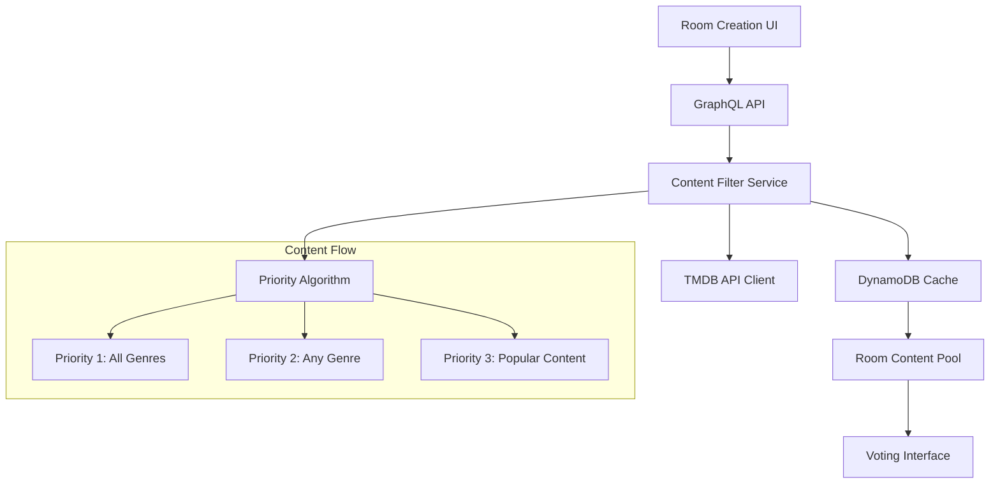

# Design Document: Advanced Content Filtering

## Overview

El sistema de filtrado avanzado de contenido extiende la funcionalidad existente de salas de votación agregando capacidades de filtrado inteligente por tipo de media y géneros. El sistema utiliza un algoritmo de priorización de tres niveles que optimiza la relevancia del contenido mientras mantiene variedad y aleatoriedad.

La arquitectura se integra con la infraestructura existente (GraphQL, DynamoDB, TMDB API) y mantiene compatibilidad completa con salas legacy. El diseño enfatiza eficiencia de cache, experiencia de usuario fluida y escalabilidad.

## Architecture

### High-Level Architecture



### Integration Points

- **GraphQL Schema**: Extensión de tipos Room y Mutation existentes
- **DynamoDB**: Nuevas tablas para cache de filtros y exclusiones
- **TMDB API**: Integración con endpoints `/discover/movie` y `/discover/tv`
- **Existing Room System**: Compatibilidad total con funcionalidad actual

## Components and Interfaces

### 1. Content Filter Service

**Responsabilidad**: Orquestación del filtrado y carga de contenido

```typescript
interface ContentFilterService {
  createFilteredRoom(criteria: FilterCriteria): Promise<Room>
  loadContentPool(roomId: string, excludeIds: string[]): Promise<Content[]>
  getAvailableGenres(mediaType: MediaType): Promise<Genre[])
}

interface FilterCriteria {
  mediaType: MediaType
  genres: string[]  // Máximo 3 géneros
  roomId: string
}
```

### 2. Priority Algorithm Engine

**Responsabilidad**: Implementación del algoritmo de priorización de tres niveles

```typescript
interface PriorityAlgorithm {
  prioritizeContent(
    content: TMDBContent[], 
    criteria: FilterCriteria
  ): PrioritizedContent[]
}

interface PrioritizedContent {
  content: TMDBContent[]
  priority: 1 | 2 | 3
  randomized: boolean
}
```

### 3. TMDB API Client Enhancement

**Responsabilidad**: Comunicación optimizada con TMDB API

```typescript
interface TMDBClient {
  discoverMovies(params: DiscoverParams): Promise<TMDBContent[]>
  discoverTV(params: DiscoverParams): Promise<TMDBContent[]>
  getMovieGenres(): Promise<Genre[]>
  getTVGenres(): Promise<Genre[]>
}

interface DiscoverParams {
  withGenres?: string  // "28,12" para AND, "28|12" para OR
  sortBy: 'popularity.desc' | 'vote_average.desc'
  page: number
  excludeIds?: string[]
}
```

### 4. Filter Cache Manager

**Responsabilidad**: Gestión eficiente de cache por combinaciones de filtros

```typescript
interface FilterCacheManager {
  getCachedContent(criteria: FilterCriteria): Promise<Content[] | null>
  setCachedContent(criteria: FilterCriteria, content: Content[]): Promise<void>
  invalidateCache(criteria: FilterCriteria): Promise<void>
  trackShownContent(roomId: string, contentIds: string[]): Promise<void>
}
```

### 5. Room Filter UI Components

**Responsabilidad**: Interfaz de usuario para configuración de filtros

```typescript
interface RoomFilterUI {
  MediaTypeSelector: React.Component<{
    onSelect: (type: MediaType) => void
  }>
  
  GenreSelector: React.Component<{
    genres: Genre[]
    maxSelection: 3
    onSelectionChange: (selected: string[]) => void
  }>
  
  FilterSummary: React.Component<{
    criteria: FilterCriteria
    estimatedCount: number
  }>
}
```

## Data Models

### Extended Room Model

```typescript
interface Room {
  // Campos existentes
  id: string
  name: string
  createdBy: string
  participants: User[]
  
  // Nuevos campos para filtrado
  filterCriteria?: FilterCriteria
  contentPool: ContentPoolEntry[]
  excludedContentIds: string[]
  lastContentRefresh: Date
}

interface ContentPoolEntry {
  tmdbId: string
  mediaType: MediaType
  title: string
  posterPath?: string
  overview: string
  genreIds: number[]
  voteAverage: number
  releaseDate: string
  priority: 1 | 2 | 3
  addedAt: Date
}
```

### Filter Cache Schema

```typescript
interface FilterCacheEntry {
  cacheKey: string  // Hash de FilterCriteria
  mediaType: MediaType
  genreIds: number[]
  content: TMDBContent[]
  createdAt: Date
  expiresAt: Date
  totalAvailable: number
}

interface RoomExclusions {
  roomId: string
  excludedIds: Set<string>
  lastUpdated: Date
}
```

### Genre Model

```typescript
interface Genre {
  id: number
  name: string
  mediaType: MediaType
}
```

## Priority Algorithm Implementation

### Three-Tier Priority System

**Priority 1: Perfect Match (All Genres)**
- Contenido que contiene TODOS los géneros seleccionados
- Usa parámetro `with_genres` con comas: `"28,12,16"`
- Ordenado por `vote_average.desc` y luego aleatorizado

**Priority 2: Partial Match (Any Genre)**  
- Contenido que contiene AL MENOS UN género seleccionado
- Usa parámetro `with_genres` con pipes: `"28|12|16"`
- Excluye contenido ya incluido en Priority 1
- Ordenado por `popularity.desc` y luego aleatorizado

**Priority 3: Popular Fallback**
- Contenido popular del mismo MediaType sin filtros de género
- Excluye contenido de Priority 1 y 2
- Ordenado por `popularity.desc` y luego aleatorizado

### Algorithm Flow

```typescript
async function generatePrioritizedContent(
  criteria: FilterCriteria, 
  excludeIds: string[]
): Promise<Content[]> {
  const results: Content[] = []
  
  // Priority 1: All genres (AND logic)
  if (criteria.genres.length > 0) {
    const allGenresContent = await tmdbClient.discover({
      mediaType: criteria.mediaType,
      withGenres: criteria.genres.join(','),
      sortBy: 'vote_average.desc',
      excludeIds
    })
    results.push(...randomize(allGenresContent).slice(0, 15))
  }
  
  // Priority 2: Any genre (OR logic)  
  if (criteria.genres.length > 0 && results.length < 30) {
    const anyGenreContent = await tmdbClient.discover({
      mediaType: criteria.mediaType,
      withGenres: criteria.genres.join('|'),
      sortBy: 'popularity.desc',
      excludeIds: [...excludeIds, ...results.map(r => r.id)]
    })
    const needed = 30 - results.length
    results.push(...randomize(anyGenreContent).slice(0, needed))
  }
  
  // Priority 3: Popular fallback
  if (results.length < 30) {
    const popularContent = await tmdbClient.discover({
      mediaType: criteria.mediaType,
      sortBy: 'popularity.desc',
      excludeIds: [...excludeIds, ...results.map(r => r.id)]
    })
    const needed = 30 - results.length
    results.push(...randomize(popularContent).slice(0, needed))
  }
  
  return results
}
```

## Correctness Properties

*Una propiedad es una característica o comportamiento que debe mantenerse verdadero en todas las ejecuciones válidas de un sistema - esencialmente, una declaración formal sobre lo que el sistema debe hacer. Las propiedades sirven como puente entre especificaciones legibles por humanos y garantías de corrección verificables por máquinas.*

### Property 1: Media Type Selection Flow
*For any* room creation process, selecting a media type should store the selection and trigger genre loading for that specific media type
**Validates: Requirements 1.2, 1.4**

### Property 2: Room Creation Validation
*For any* room creation attempt, the system should prevent creation without media type selection and allow creation with valid media type and 0-3 genres
**Validates: Requirements 1.3, 2.4**

### Property 3: Genre Selection Limits
*For any* genre selection interface, the system should allow selection of up to 3 genres and prevent selection of more than 3 genres with appropriate validation
**Validates: Requirements 2.2, 2.3**

### Property 4: Content Pool Size Consistency
*For any* room created with filter criteria, the system should pre-load exactly 30 titles when available, or all available titles if fewer than 30 exist
**Validates: Requirements 3.1, 3.5**

### Property 5: Priority Algorithm Correctness
*For any* content loading with selected genres, the system should prioritize content containing all genres first, then content with any genre, then popular content of the same media type
**Validates: Requirements 3.2**

### Property 6: Priority Level Randomization
*For any* content loading within the same priority level, multiple executions should produce different orderings of the same content set
**Validates: Requirements 3.3**

### Property 7: API Endpoint Mapping
*For any* media type selection, the system should use `/discover/movie` for MOVIE type and `/discover/tv` for TV type
**Validates: Requirements 4.1, 4.2**

### Property 8: Genre Parameter Formatting
*For any* multi-genre query, the system should use comma-separated IDs for AND logic (Priority 1) and pipe-separated IDs for OR logic (Priority 2)
**Validates: Requirements 4.3, 4.4**

### Property 9: API Response Completeness
*For any* content retrieved from TMDB API, all required fields (id, title/name, poster_path, overview, genre_ids, vote_average, release_date/first_air_date) should be present
**Validates: Requirements 4.5**

### Property 10: Content Pool Replenishment
*For any* room with fewer than 5 titles remaining, the system should automatically load 30 additional titles excluding previously shown content
**Validates: Requirements 5.1, 5.2**

### Property 11: Filter Criteria Consistency
*For any* content reload operation, the system should use identical filter criteria as the original room creation
**Validates: Requirements 5.3**

### Property 12: Filter Immutability
*For any* room created with filter criteria, the media type and selected genres should be immutable after creation
**Validates: Requirements 6.1, 6.2, 6.3**

### Property 13: Cache Management by Filter Criteria
*For any* identical filter criteria combination, the system should reuse cached content when available and create separate cache entries for different combinations
**Validates: Requirements 7.1, 7.2**

### Property 14: Content Exclusion Tracking
*For any* room, the system should track shown titles and exclude them from future content loads
**Validates: Requirements 7.4**

### Property 15: UI State Management
*For any* genre selection reaching 3 items, the system should disable remaining genre options and display accurate selection count
**Validates: Requirements 8.2, 8.3**

### Property 16: Legacy Room Compatibility
*For any* existing room without filter criteria, the system should continue using original content loading mechanisms without applying new filtering logic
**Validates: Requirements 9.1, 9.2, 9.3**

### Property 17: Schema Compatibility
*For any* existing GraphQL query or mutation, the system should maintain full backward compatibility
**Validates: Requirements 9.4**

## Error Handling

### Critical Bug Resolution - getRoom Resolver Fields

**Issue Identified**: The `getRoom` GraphQL resolver was not returning the filtering fields (`mediaType`, `genreIds`, `genreNames`) to the frontend, causing the system to always fall back to legacy content loading.

**Root Cause**: The resolver in `infrastructure/src/handlers/room.ts` was only returning basic room fields without explicitly including the filtering criteria fields.

**Resolution**: Updated the resolver to explicitly return all filtering fields:
```typescript
// Return the room data with all fields including filtering criteria
return {
  ...room,
  // Ensure filtering fields are included
  mediaType: room.mediaType || null,
  genreIds: room.genreIds || [],
  genreNames: room.genreNames || [],
  contentIds: room.contentIds || null
};
```

**Frontend Updates**: 
- Updated `mediaService.ts` to call `getRoom()` and extract filtering criteria before content loading
- Updated `appSyncService.ts` GraphQL query to include all filtering fields
- Replaced hardcoded empty genre arrays with actual room data

**Impact**: This fix enables the complete filtering system functionality, allowing rooms to use advanced content filtering instead of falling back to legacy behavior.

### API Error Management
- **TMDB API Failures**: Implement exponential backoff with circuit breaker pattern
- **Rate Limiting**: Queue requests and implement request throttling
- **Network Timeouts**: Fallback to cached content when available
- **Invalid Responses**: Validate API responses and handle malformed data gracefully

### Content Availability Edge Cases
- **Insufficient Content**: When fewer than 30 titles available, load all available and notify users
- **No Content Found**: Provide clear messaging and suggest filter adjustments
- **Cache Misses**: Graceful degradation to direct API calls with performance logging

### User Input Validation
- **Invalid Genre Combinations**: Prevent selection of non-existent genre IDs
- **Malformed Filter Criteria**: Validate filter structure before processing
- **Concurrent Modifications**: Handle race conditions in room creation

### System Resilience
- **Database Failures**: Implement retry logic with exponential backoff
- **Cache Corruption**: Automatic cache invalidation and regeneration
- **Memory Pressure**: Implement content pool size limits and cleanup

## Testing Strategy

### Dual Testing Approach

El sistema utilizará tanto pruebas unitarias como pruebas basadas en propiedades para garantizar cobertura comprehensiva:

**Unit Tests**: Se enfocarán en casos específicos, condiciones de borde y manejo de errores:
- Validación de límites de selección de géneros (0, 1, 2, 3, 4+ géneros)
- Manejo de respuestas vacías de TMDB API
- Casos de error de red y timeouts
- Integración entre componentes UI y servicios backend
- Migración de datos de salas legacy

**Property-Based Tests**: Verificarán propiedades universales a través de múltiples entradas:
- Algoritmo de priorización con diferentes combinaciones de géneros
- Consistencia de cache con criterios de filtro variados
- Inmutabilidad de filtros después de creación de sala
- Exclusión correcta de contenido ya mostrado
- Compatibilidad con esquemas GraphQL existentes

### Property-Based Testing Configuration

- **Framework**: Se utilizará la librería de property-based testing nativa del lenguaje de implementación
- **Iteraciones**: Mínimo 100 iteraciones por prueba de propiedad
- **Etiquetado**: Cada prueba referenciará su propiedad del documento de diseño
- **Formato de etiqueta**: **Feature: advanced-content-filtering, Property {number}: {property_text}**

### Test Coverage Requirements

- Cada propiedad de corrección debe implementarse como UNA SOLA prueba basada en propiedades
- Las pruebas unitarias deben complementar las pruebas de propiedades, no duplicarlas
- Cobertura mínima del 90% en componentes críticos (Priority Algorithm, Filter Cache Manager)
- Pruebas de integración para flujos end-to-end de creación de salas con filtros

### Performance Testing

- Benchmarks de rendimiento para algoritmo de priorización con diferentes tamaños de dataset
- Pruebas de carga para cache de filtros con múltiples combinaciones concurrentes
- Medición de latencia de API calls a TMDB con diferentes parámetros de filtrado