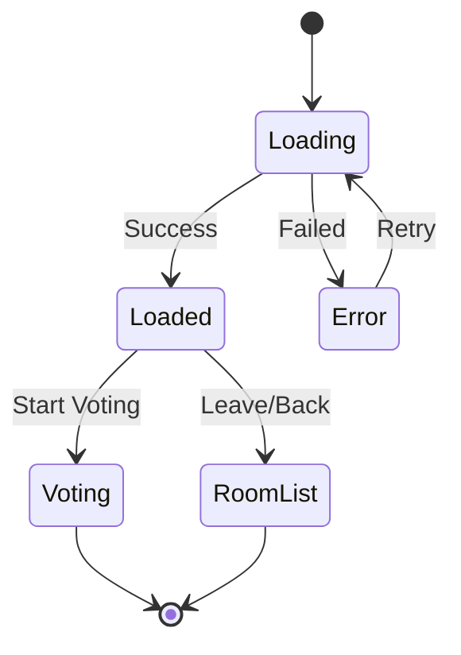

# Design Document: Room Details Screen

## Overview

The Room Details Screen serves as an intermediate interface between room selection and voting activities. It provides comprehensive information about a room, facilitates member management, and allows hosts to control when voting begins. This enhanced version focuses on improved visual design, advanced invitation features, and better user experience through modern UI patterns and interactive elements.

## Architecture

### Component Structure

```
RoomDetailsScreen
├── RoomHeader
│   ├── RoomTitle (enhanced typography)
│   ├── RoomDescription
│   └── RoomStatus (colored indicators)
├── EnhancedInviteSection
│   ├── StyledInviteCode (improved visual design)
│   ├── CopyButton (with animation feedback)
│   ├── InviteButton (prominent "Invitar Amigos")
│   ├── ShareableLink
│   └── InvitationModal
│       ├── WhatsAppShare
│       ├── EmailShare
│       ├── SMSShare
│       ├── QRCode
│       └── CopyLink
├── EnhancedMembersPanel
│   ├── MembersList (with avatars/initials)
│   ├── MemberCount
│   ├── HostIndicator
│   ├── OnlineStatusIndicators
│   └── JoinAnimations
├── VisualRoomConfiguration
│   ├── GenresList (with icons)
│   ├── MovieCount (visual indicators)
│   ├── VotingSettings
│   └── ExpandableDetails
├── StyledActionButtons
│   ├── StartVotingButton (enhanced styling)
│   ├── WaitingMessage (with animations)
│   └── LeaveRoomButton (improved design)
├── NavigationBar
│   └── BackButton (with hover effects)
└── LoadingStates
    ├── SkeletonScreens
    └── AnimatedSpinners
```

### State Management

The component will manage the following enhanced state:

```typescript
interface RoomDetailsState {
  room: Room | null;
  members: Member[];
  isHost: boolean;
  isLoading: boolean;
  error: string | null;
  connectionStatus: 'connected' | 'connecting' | 'disconnected';
  copySuccess: boolean;
  
  // Enhanced UI State
  showInvitationModal: boolean;
  invitationStats: InvitationStats;
  animationStates: {
    memberJoin: boolean;
    copyFeedback: boolean;
    loadingTransition: boolean;
  };
  
  // Visual State
  expandedSections: {
    configuration: boolean;
    members: boolean;
  };
}

interface InvitationStats {
  totalInvitesSent: number;
  membersJoinedViaInvite: number;
  lastInviteSentAt?: string;
}
```

## Components and Interfaces

### Core Interfaces

```typescript
interface Room {
  id: string;
  name: string;
  description?: string;
  status: 'waiting' | 'active' | 'completed';
  hostId: string;
  inviteCode: string;
  genres: string[];
  movieCount: number;
  createdAt: string;
  memberCount: number;
}

interface Member {
  id: string;
  email: string;
  displayName?: string;
  isHost: boolean;
  isConnected: boolean;
  joinedAt: string;
}

interface RoomDetailsProps {
  roomId: string;
  onStartVoting: () => void;
  onLeaveRoom: () => void;
  onBack: () => void;
}
```

### Component APIs

#### RoomDetailsScreen Component

**Props:**
- `roomId: string` - ID of the room to display
- `onStartVoting: () => void` - Callback when host starts voting
- `onLeaveRoom: () => void` - Callback when user leaves room
- `onBack: () => void` - Callback for navigation back

**Methods:**
- `loadRoomDetails()` - Fetch room information
- `subscribeToUpdates()` - Setup real-time subscriptions
- `copyInviteCode()` - Copy invite code to clipboard
- `startVoting()` - Initiate voting session (host only)
- `leaveRoom()` - Leave the current room

#### Enhanced InviteSection Component

**Props:**
- `inviteCode: string` - The room's invite code
- `roomName: string` - Room name for sharing messages
- `onCopy: (code: string) => void` - Callback when code is copied
- `onShare: (method: ShareMethod, data: ShareData) => void` - Callback for sharing actions

**Features:**
- Prominent "Invitar Amigos" button with modern styling
- Enhanced invite code display with background and hover effects
- Multi-platform sharing modal (WhatsApp, Email, SMS, QR Code)
- Animated copy feedback with checkmark icon
- Invitation statistics tracking
- Visual feedback for all interactions

**Share Methods:**
```typescript
enum ShareMethod {
  WHATSAPP = 'whatsapp',
  EMAIL = 'email',
  SMS = 'sms',
  COPY_LINK = 'copy_link',
  QR_CODE = 'qr_code'
}

interface ShareData {
  inviteCode: string;
  roomName: string;
  inviteLink: string;
  message: string;
}
```

#### Enhanced MembersPanel Component

**Props:**
- `members: Member[]` - List of room members
- `currentUserId: string` - ID of current user
- `onMemberInteraction: (memberId: string, action: string) => void` - Member interaction callback

**Features:**
- User avatars or colored initials circles
- Real-time online status indicators (green dot for online)
- Smooth join/leave animations
- Expandable member details
- Host badge with special styling
- Member count with visual emphasis

#### Visual RoomConfiguration Component

**Props:**
- `genres: string[]` - Selected genres
- `movieCount: number` - Number of movies
- `votingType: string` - Type of voting system
- `isExpandable: boolean` - Whether section can be collapsed

**Features:**
- Genre icons and visual tags
- Progress indicators for movie count
- Expandable/collapsible sections
- Visual hierarchy with proper spacing
- Hover effects and transitions

## Data Models

### Room Data Structure

```typescript
interface RoomDetails {
  // Basic Information
  id: string;
  name: string;
  description?: string;
  status: RoomStatus;
  
  // Access Control
  hostId: string;
  inviteCode: string;
  
  // Configuration
  genres: string[];
  movieCount: number;
  votingType: 'like_dislike' | 'rating';
  
  // Metadata
  createdAt: string;
  updatedAt: string;
  memberCount: number;
}

enum RoomStatus {
  WAITING = 'waiting',
  ACTIVE = 'active', 
  COMPLETED = 'completed'
}
```

### Member Data Structure

```typescript
interface RoomMember {
  id: string;
  userId: string;
  email: string;
  displayName?: string;
  isHost: boolean;
  isConnected: boolean;
  joinedAt: string;
  lastSeen: string;
}
```

## Real-time Integration

### WebSocket Subscriptions

The screen will subscribe to the following real-time events:

1. **Member Updates**
   ```graphql
   subscription OnMemberUpdate($roomId: ID!) {
     onMemberUpdate(roomId: $roomId) {
       id
       userId
       email
       isConnected
       joinedAt
     }
   }
   ```

2. **Room Status Changes**
   ```graphql
   subscription OnRoomStatusChange($roomId: ID!) {
     onRoomStatusChange(roomId: $roomId) {
       id
       status
       updatedAt
     }
   }
   ```

3. **Voting Session Start**
   ```graphql
   subscription OnVotingStart($roomId: ID!) {
     onVotingStart(roomId: $roomId) {
       roomId
       startedBy
       startedAt
     }
   }
   ```

### GraphQL Queries and Mutations

#### Queries

```graphql
query GetRoomDetails($roomId: ID!) {
  getRoomDetails(roomId: $roomId) {
    id
    name
    description
    status
    hostId
    inviteCode
    genres
    movieCount
    createdAt
    memberCount
    members {
      id
      userId
      email
      displayName
      isHost
      isConnected
      joinedAt
    }
  }
}
```

#### Mutations

```graphql
mutation StartVotingSession($roomId: ID!) {
  startVotingSession(roomId: $roomId) {
    success
    message
    sessionId
  }
}

mutation LeaveRoom($roomId: ID!) {
  leaveRoom(roomId: $roomId) {
    success
    message
  }
}
```

## User Interface Design

### Enhanced Layout Structure

```
┌─────────────────────────────────────┐
│ ← Back          Room Details        │
├─────────────────────────────────────┤
│                                     │
│  🎬 [Room Name] (Enhanced Typography)│
│  [Room Description]                 │
│  Status: ● Waiting (Colored Dot)    │
│                                     │
├─────────────────────────────────────┤
│  📋 Invite Code (Enhanced Design)   │
│  ┌─────────────────────────────────┐ │
│  │        ABC123                   │ │
│  │  (Styled Background & Border)   │ │
│  └─────────────────────────────────┘ │
│  ┌─────────────────────────────────┐ │
│  │    👥 Invitar Amigos           │ │
│  │  (Prominent Button)             │ │
│  └─────────────────────────────────┘ │
│  Share: localhost:3000/room/ABC123  │
├─────────────────────────────────────┤
│  👥 Members (2) [Expandable]        │
│  ┌─┐ test@trinity.app (Host) ●      │
│  │T│ (Avatar/Initial Circle)        │
│  └─┘                               │
│  ┌─┐ test@trinity.com ●            │
│  │U│ (Colored Initial)              │
│  └─┘                               │
├─────────────────────────────────────┤
│  🎭 Configuration [Expandable]      │
│  🎬 Action  🎭 Comedy  🎪 Drama     │
│  📊 Movies: ~50 películas           │
│  ⭐ Voting: Like/Dislike system     │
├─────────────────────────────────────┤
│  ┌─────────────────────────────────┐ │
│  │      🚀 Empezar Votación       │ │
│  │    (Enhanced Button Style)      │ │
│  └─────────────────────────────────┘ │
│  ┌─────────────────────────────────┐ │
│  │         Salir de la Sala        │ │
│  │      (Improved Styling)         │ │
│  └─────────────────────────────────┘ │
└─────────────────────────────────────┘

Invitation Modal (when opened):
┌─────────────────────────────────────┐
│  Invitar a Trinity - Romance        │
├─────────────────────────────────────┤
│  📱 Compartir por WhatsApp          │
│  ✉️  Enviar por Email               │
│  💬 Enviar por SMS                  │
│  📋 Copiar Enlace                   │
│  ┌─────────────────────────────────┐ │
│  │        QR Code                  │ │
│  │    ▄▄▄▄▄▄▄▄▄▄▄▄▄▄▄▄▄▄▄▄▄▄▄▄▄   │ │
│  │    █ ▄▄▄▄▄ █   █▄ █▄▀█ ▄▄▄▄▄ █ │ │
│  │    (QR Code for mobile scan)    │ │
│  └─────────────────────────────────┘ │
│  📊 Invitaciones enviadas: 3        │
└─────────────────────────────────────┘
```

### Responsive Design

**Mobile Layout:**
- Stack sections vertically
- Larger touch targets for buttons
- Collapsible sections for better space usage
- Swipe gestures for navigation

**Web Layout:**
- Two-column layout on larger screens
- Hover effects for interactive elements
- Keyboard shortcuts support
- Context menus for additional actions

### Enhanced Visual Design Elements

**Color Scheme:**
- Primary: `#8b5cf6` (Purple) - Main brand color
- Secondary: `#06b6d4` (Cyan) - Accent color
- Success: `#22c55e` (Green) - Online status, success states
- Warning: `#eab308` (Yellow) - Waiting states
- Error: `#ef4444` (Red) - Error states, leave actions
- Background: `#1a1a2e` (Dark Blue) - Main background
- Surface: `#2d2d44` (Lighter Dark) - Card backgrounds
- Border: `#404040` (Gray) - Subtle borders

**Typography Hierarchy:**
- Room Title: Bold, 24px, Primary color
- Section Headers: Semibold, 18px, White
- Body Text: Regular, 16px, Light gray
- Invite Code: Monospace, 20px, Highlighted
- Captions: Light, 14px, Muted gray
- Button Text: Medium, 16px, White

**Interactive Elements:**

*Buttons:*
- Primary Button: Gradient background, rounded corners, shadow
- Secondary Button: Outlined style with hover fill
- Icon Buttons: Circular, subtle background, hover effects
- Copy Button: Animated checkmark feedback

*Cards and Sections:*
- Rounded corners (12px radius)
- Subtle shadows and borders
- Hover effects with slight elevation
- Smooth transitions (200ms ease)

*Status Indicators:*
- Online: Green dot with pulse animation
- Offline: Gray dot, static
- Host Badge: Purple background with crown icon
- Room Status: Colored text with matching dot

*Animations and Transitions:*
- Member join: Slide-in from right with fade
- Copy feedback: Scale + checkmark animation
- Loading states: Skeleton screens with shimmer
- Hover effects: Subtle scale and color changes
- Modal transitions: Slide-up with backdrop fade

**Responsive Adaptations:**

*Mobile Optimizations:*
- Larger touch targets (minimum 44px)
- Increased spacing between elements
- Collapsible sections for space efficiency
- Swipe gestures for navigation
- Pull-to-refresh functionality

*Tablet/Desktop Enhancements:*
- Two-column layout for larger screens
- Hover states for all interactive elements
- Keyboard navigation support
- Context menus for additional actions
- Tooltips for icon-only buttons

## Navigation Flow

### Entry Points

1. **After Room Creation:**
   ```
   Create Room Modal → Room Details Screen
   ```

2. **From Room Selection:**
   ```
   Room List → Room Details Screen
   ```

3. **From Invite Link:**
   ```
   Invite URL → Join Room → Room Details Screen
   ```

### Exit Points

1. **Start Voting (Host):**
   ```
   Room Details → Voting Interface
   ```

2. **Leave Room:**
   ```
   Room Details → Room List
   ```

3. **Back Navigation:**
   ```
   Room Details → Room List
   ```

### State Transitions



## Error Handling

### Error Scenarios

1. **Room Not Found**
   - Display: "Sala no encontrada"
   - Action: Return to room list
   - Logging: Log room ID and user context

2. **Permission Denied**
   - Display: "No tienes acceso a esta sala"
   - Action: Return to room list
   - Logging: Log access attempt

3. **Network Connection Lost**
   - Display: Connection status indicator
   - Action: Attempt automatic reconnection
   - Fallback: Manual refresh button

4. **Failed to Start Voting**
   - Display: "Error al iniciar votación"
   - Action: Retry button
   - Logging: Log error details

### Error Recovery

```typescript
interface ErrorRecovery {
  retryAttempts: number;
  backoffStrategy: 'exponential' | 'linear';
  fallbackActions: string[];
  userNotification: boolean;
}
```

## Performance Considerations

### Optimization Strategies

1. **Data Fetching**
   - Cache room details locally
   - Implement optimistic updates
   - Batch member updates

2. **Real-time Updates**
   - Debounce rapid member changes
   - Limit update frequency
   - Use efficient diff algorithms

3. **Rendering**
   - Virtualize large member lists
   - Lazy load non-critical data
   - Implement proper memoization

### Metrics to Monitor

- Screen load time
- Real-time update latency
- Memory usage during long sessions
- Battery impact on mobile devices

## Testing Strategy

### Unit Tests

1. **Component Rendering**
   - Verify all sections display correctly
   - Test different room states
   - Validate responsive behavior

2. **State Management**
   - Test state updates
   - Verify error handling
   - Check loading states

3. **User Interactions**
   - Copy to clipboard functionality
   - Button click handlers
   - Navigation actions

### Integration Tests

1. **Real-time Updates**
   - Member join/leave events
   - Room status changes
   - Connection handling

2. **API Integration**
   - Room data fetching
   - Mutation execution
   - Error responses

### End-to-End Tests

1. **Complete User Flows**
   - Room creation to voting start
   - Invite sharing and joining
   - Multi-user scenarios

2. **Cross-Platform Testing**
   - Web browser compatibility
   - Mobile device testing
   - Network condition variations

## Correctness Properties

*A property is a characteristic or behavior that should hold true across all valid executions of a system-essentially, a formal statement about what the system should do. Properties serve as the bridge between human-readable specifications and machine-verifiable correctness guarantees.*

### Property 1: Room Information Display Completeness
*For any* valid room, the Room Details Screen should display the room name, status, and invite code prominently
**Validates: Requirements 1.3, 1.5, 2.1**

### Property 2: Conditional Description Display
*For any* room with a description field, the Room Details Screen should display that description
**Validates: Requirements 1.4**

### Property 3: Copy-to-Clipboard Functionality
*For any* room with an invite code, clicking the copy button should copy the exact invite code to the clipboard and show confirmation
**Validates: Requirements 2.3**

### Property 4: Shareable Link Generation
*For any* room, the Room Details Screen should generate a properly formatted shareable link containing the invite code
**Validates: Requirements 2.4**

### Property 5: Member List Accuracy
*For any* room, the displayed member list should contain exactly the same members as the actual room membership, with correct host identification
**Validates: Requirements 3.1, 3.3, 3.4**

### Property 6: Member Count Consistency
*For any* room, the displayed member count should equal the actual number of members in the member list
**Validates: Requirements 3.5**

### Property 7: Real-time Member Updates
*For any* member join or leave event, the member list should update to reflect the change within a reasonable time window
**Validates: Requirements 3.2, 6.2**

### Property 8: Room Configuration Display
*For any* room, the Room Details Screen should display the configured genres, movie count, and voting format
**Validates: Requirements 4.1, 4.2, 4.5**

### Property 9: Host-Specific UI Elements
*For any* user who is the room host, the Room Details Screen should display the "Empezar Votación" button and not the waiting message
**Validates: Requirements 5.1**

### Property 10: Non-Host UI Elements
*For any* user who is not the room host, the Room Details Screen should display the "Esperando al host..." message and not the start voting button
**Validates: Requirements 5.3**

### Property 11: Universal Leave Option
*For any* user in any room, the Room Details Screen should provide a "Salir de la Sala" option
**Validates: Requirements 5.4**

### Property 12: Real-time Status Updates
*For any* room status change, the Room Details Screen should automatically update to reflect the new status
**Validates: Requirements 6.1**

### Property 13: Synchronized Voting Transition
*For any* room where the host starts voting, all connected members should automatically transition to voting mode
**Validates: Requirements 6.3**

### Property 14: Connection Management
*For any* Room Details Screen instance, a WebSocket connection should be maintained for real-time updates
**Validates: Requirements 6.4**

### Property 15: Connection Recovery
*For any* connection loss event, the system should show connection status and attempt to reconnect
**Validates: Requirements 6.5**

### Property 16: Navigation Elements
*For any* Room Details Screen instance, a back button should be present and functional
**Validates: Requirements 7.1**

### Property 17: Loading State Display
*For any* room data fetch operation, appropriate loading states should be displayed during the fetch process
**Validates: Requirements 7.4**

### Property 19: Enhanced Invitation Button Display
*For any* room details screen, a prominent "Invitar Amigos" button should be displayed with proper styling and accessibility
**Validates: Requirements 8.1**

### Property 20: Invitation Modal Functionality
*For any* "Invitar Amigos" button click, the system should display a modal with multiple sharing options (WhatsApp, email, SMS, copy link)
**Validates: Requirements 8.2, 8.3, 8.4, 8.5**

### Property 21: QR Code Generation
*For any* invitation modal, a valid QR code should be generated that contains the room invitation link
**Validates: Requirements 8.6**

### Property 22: Invitation Statistics Tracking
*For any* room with sent invitations, the system should display accurate invitation statistics including join count
**Validates: Requirements 8.7**

### Property 23: Enhanced Invite Code Visual Design
*For any* invite code display, it should have improved visual styling with background, borders, and hover effects
**Validates: Requirements 8.8**

### Property 24: Status Indicator Color Coding
*For any* room status, the display should use appropriate colored indicators (green for waiting, blue for active, gray for completed)
**Validates: Requirements 9.2**

### Property 25: Member Avatar Display
*For any* member in the member list, the system should display either a user avatar or colored initials circle
**Validates: Requirements 9.3**

### Property 26: Genre Icon Display
*For any* room configuration section, genres should be displayed with appropriate icons and visual indicators
**Validates: Requirements 9.4**

### Property 27: Enhanced Visual Styling
*For any* room details screen element, it should follow the enhanced visual design with proper colors, typography, and spacing
**Validates: Requirements 9.5, 9.6, 9.7, 9.8**

### Property 28: Interactive Hover Effects
*For any* interactive element, hovering should provide visual feedback through color changes, cursor updates, or other effects
**Validates: Requirements 10.1**

### Property 29: Copy Animation Feedback
*For any* successful copy operation, the system should show an animated confirmation with checkmark icon
**Validates: Requirements 10.2**

### Property 30: Online Status Indicators
*For any* member in the member list, their online status should be displayed with real-time visual indicators
**Validates: Requirements 10.3**

### Property 31: Member Join Animation
*For any* new member joining the room, the system should display a brief welcome animation or notification
**Validates: Requirements 10.4**

### Property 32: Expandable Configuration Section
*For any* room configuration section, it should be expandable/collapsible for better space utilization
**Validates: Requirements 10.5**

### Property 33: Mobile Pull-to-Refresh
*For any* room details screen on mobile, pull-to-refresh functionality should be available and functional
**Validates: Requirements 10.6**

### Property 34: Loading State Display
*For any* loading operation, the system should show appropriate loading spinners or skeleton screens
**Validates: Requirements 10.7**

### Property 35: Mobile Haptic Feedback
*For any* button interaction on mobile devices, appropriate haptic feedback should be provided
**Validates: Requirements 10.8**

## Security Considerations

### Access Control

- Verify user permissions for room access
- Validate host privileges for room control
- Sanitize all user inputs

### Data Protection

- Encrypt sensitive room data
- Implement rate limiting for API calls
- Audit room access attempts

### Privacy

- Limit member information exposure
- Respect user privacy settings
- Implement data retention policies