# Design Document: Room Functionality Fixes

## Overview

This design document outlines the fixes required to make Trinity's room functionality fully operational. The current system has a complete AWS serverless infrastructure deployed but is not working due to missing AppSync Subscription Resolvers and configuration issues. The primary goal is to fix the existing functionality without adding new features, ensuring that users can create rooms, join across platforms, and receive real-time updates.

Based on the diagnostic analysis, the main issue is that AppSync has 0 Subscription Resolvers configured, preventing real-time event distribution. All other components (Lambda functions, DynamoDB tables, GraphQL schema) are properly deployed and functional.

## Architecture

### Current Infrastructure (Already Deployed)

```mermaid
graph TD
    subgraph "Frontend Layer - ✅ Working"
        Mobile[📱 Mobile App<br/>React Native + AppSync Client]
        Web[🌐 Web App<br/>React + AppSync Client]
    end

    subgraph "API Layer - ⚠️ Partially Working"
        AppSync[🔗 AWS AppSync<br/>API ID: epjtt2y3fzh53ii6omzj6n6h5a<br/>✅ 16 Mutation Resolvers<br/>❌ 0 Subscription Resolvers]
    end

    subgraph "Compute Layer - ✅ Working"
        RoomLambda[🏠 trinity-room-dev<br/>✅ Create/Join Rooms]
        VoteLambda[🗳️ trinity-vote-dev<br/>✅ Process Votes]
        RealtimeLambda[📡 trinity-realtime-dev<br/>✅ Publish Events]
        AuthLambda[🔐 trinity-auth-dev<br/>✅ Authentication]
        MovieLambda[🎬 trinity-movie-dev<br/>✅ Movie Data]
        AILambda[🤖 trinity-ai-dev<br/>✅ AI Recommendations]
    end

    subgraph "Data Layer - ✅ Working"
        RoomsTable[(🏠 trinity-rooms-dev<br/>✅ Room Storage)]
        MembersTable[(👥 trinity-room-members-dev<br/>✅ Membership)]
        VotesTable[(🗳️ trinity-votes-dev<br/>✅ Vote Tracking)]
        UsersTable[(👤 trinity-users-dev<br/>✅ User Profiles)]
    end

    Mobile -->|GraphQL Mutations ✅| AppSync
    Web -->|GraphQL Mutations ✅| AppSync
    Mobile -.->|Subscriptions ❌| AppSync
    Web -.->|Subscriptions ❌| AppSync
    
    AppSync -->|✅ Working| RoomLambda
    AppSync -->|✅ Working| VoteLambda
    AppSync -->|✅ Working| RealtimeLambda
    
    RoomLambda -->|✅ Working| RoomsTable
    RoomLambda -->|✅ Working| MembersTable
    VoteLambda -->|✅ Working| VotesTable
```



### Problem Analysis

**Current Flow (Broken)**:
```
1. User creates room on mobile ✅
2. Room stored in DynamoDB ✅
3. User tries to join from web ❌ (Authentication/Schema issues)
4. User votes ✅
5. Vote stored in DynamoDB ✅
6. Real-time event published ✅
7. Subscription resolvers missing ❌
8. Other users don't receive updates ❌
```

**Target Flow (Fixed)**:
```
1. User creates room on mobile ✅
2. Room stored in DynamoDB ✅
3. User joins from web ✅ (Fixed authentication)
4. User votes ✅
5. Vote stored in DynamoDB ✅
6. Real-time event published ✅
7. Subscription resolvers distribute event ✅
8. All users receive immediate updates ✅
```

## Components and Interfaces

### 1. AppSync Subscription Resolvers (Missing - To Be Added)

**Required Resolvers**:
```typescript
const subscriptionResolvers = [
  'onVoteUpdate',           // Basic vote updates
  'onMatchFound',           // When consensus is reached
  'onMemberUpdate',         // User join/leave events
  'onVoteUpdateEnhanced',   // Enhanced vote data with progress
  'onMatchFoundEnhanced',   // Enhanced match data with participants
  'onConnectionStatusChange', // Connection status updates
  'onRoomStateSync'         // Full room state synchronization
];
```

**Data Source Configuration**:
```typescript
// Use "None" data source for optimal performance
const noneDataSource = {
  name: 'NoneDataSource',
  type: 'NONE',
  description: 'Data source for real-time subscriptions'
};
```

**Resolver Template**:
```vtl
# Request Mapping Template
{
  "version": "2017-02-28",
  "payload": {}
}

# Response Mapping Template
$util.toJson($context.result)
```

### 2. GraphQL Schema Validation

**Current Schema Status**:
- ✅ Mutations: 16 resolvers configured
- ✅ Queries: All working
- ❌ Subscriptions: 0 resolvers configured

**Schema Deployment Process**:
```bash
# Verify current schema
aws appsync get-schema --api-id epjtt2y3fzh53ii6omzj6n6h5a --format SDL

# Update schema if needed
aws appsync start-schema-creation \
  --api-id epjtt2y3fzh53ii6omzj6n6h5a \
  --definition "fileb://infrastructure/schema.graphql"
```

### 3. Authentication Flow Fixes

**Current Issues**:
- Web authentication may have token refresh issues
- Cross-platform token validation inconsistencies

**Authentication Architecture**:


**Token Validation Process**:
1. User authenticates with Cognito
2. Cognito returns JWT token
3. Client includes token in GraphQL requests
4. AppSync validates token against User Pool
5. Authorized requests proceed to Lambda functions

### 4. Cross-Platform Room Access

**Room Creation Flow**:
```typescript
interface RoomCreationFlow {
  // Mobile creates room
  mobile_createRoom: {
    input: CreateRoomInput;
    output: Room & { inviteCode: string };
  };
  
  // Web joins room
  web_joinRoom: {
    input: { inviteCode: string };
    output: Room;
  };
}
```

**Data Consistency Requirements**:
- Room data must be identical across platforms
- Invite codes must work universally
- Member lists must sync immediately
- Real-time events must reach all platforms

## Data Models

### Room Data Structure (Already Implemented)

```typescript
interface Room {
  // Primary Key Structure
  PK: string;                    // roomId
  SK: string;                    // "ROOM"
  
  // Room Properties
  id: string;                    // Room identifier
  name: string;                  // Room name
  description?: string;          // Optional description
  status: 'WAITING' | 'ACTIVE' | 'COMPLETED';
  hostId: string;                // Creator's user ID
  inviteCode: string;            // 6-character invite code
  inviteUrl: string;             // Deep link URL
  isActive: boolean;             // Room availability
  isPrivate: boolean;            // Privacy setting
  memberCount: number;           // Current member count
  maxMembers?: number;           // Optional member limit
  matchCount: number;            // Number of matches found
  genrePreferences?: string[];   // Optional genre filters
  createdAt: string;             // ISO timestamp
  updatedAt: string;             // ISO timestamp
}
```

### Room Member Structure (Already Implemented)

```typescript
interface RoomMember {
  // Primary Key Structure
  roomId: string;                // Partition key
  userId: string;                // Sort key
  
  // Member Properties
  role: 'HOST' | 'MEMBER';       // User role in room
  joinedAt: string;              // ISO timestamp
  isActive: boolean;             // Member status
}
```

### Real-Time Event Structure

```typescript
interface VoteUpdateEvent {
  id: string;                    // Event ID
  timestamp: string;             // ISO timestamp
  roomId: string;                // Room identifier
  eventType: 'VOTE_UPDATE';      // Event type
  userId: string;                // Voter ID
  mediaId: string;               // Movie ID
  voteType: 'LIKE' | 'DISLIKE' | 'SKIP';
  progress: VoteProgress;        // Current voting progress
}

interface VoteProgress {
  totalVotes: number;            // Total votes cast
  likesCount: number;            // Number of likes
  dislikesCount: number;         // Number of dislikes
  skipsCount: number;            // Number of skips
  remainingUsers: number;        // Users who haven't voted
  percentage: number;            // Completion percentage
  votingUsers: string[];         // Users who have voted
  pendingUsers: string[];        // Users who haven't voted
}
```

## Error Handling

### Error Categories and Solutions

```typescript
enum RoomFunctionalityError {
  // AppSync Errors
  SUBSCRIPTION_RESOLVER_MISSING = 'SUBSCRIPTION_RESOLVER_MISSING',
  SCHEMA_NOT_DEPLOYED = 'SCHEMA_NOT_DEPLOYED',
  
  // Authentication Errors
  TOKEN_EXPIRED = 'TOKEN_EXPIRED',
  TOKEN_INVALID = 'TOKEN_INVALID',
  UNAUTHORIZED_ACCESS = 'UNAUTHORIZED_ACCESS',
  
  // Room Operation Errors
  ROOM_NOT_FOUND = 'ROOM_NOT_FOUND',
  INVALID_INVITE_CODE = 'INVALID_INVITE_CODE',
  ROOM_FULL = 'ROOM_FULL',
  ALREADY_MEMBER = 'ALREADY_MEMBER',
  
  // Real-Time Errors
  SUBSCRIPTION_FAILED = 'SUBSCRIPTION_FAILED',
  CONNECTION_LOST = 'CONNECTION_LOST',
  EVENT_DELIVERY_FAILED = 'EVENT_DELIVERY_FAILED',
  
  // Data Persistence Errors
  DYNAMODB_ERROR = 'DYNAMODB_ERROR',
  CONCURRENT_MODIFICATION = 'CONCURRENT_MODIFICATION',
  DATA_CORRUPTION = 'DATA_CORRUPTION'
}
```

### Error Recovery Strategies

1. **Subscription Failures**: Automatic reconnection with exponential backoff
2. **Authentication Failures**: Token refresh and retry
3. **Network Failures**: Queue operations and retry when online
4. **Data Conflicts**: Optimistic locking with conflict resolution
5. **Service Outages**: Graceful degradation with cached data

## Testing Strategy

### Unit Tests

**AppSync Configuration Tests**:
- Verify subscription resolvers are created
- Test resolver mapping templates
- Validate data source configuration

**Lambda Function Tests**:
- Test room creation logic
- Test room joining logic
- Test real-time event publishing
- Test error handling scenarios

**Authentication Tests**:
- Test token validation
- Test cross-platform token consistency
- Test token refresh mechanisms

### Integration Tests

**Cross-Platform Room Flow**:
```typescript
describe('Cross-Platform Room Functionality', () => {
  test('Mobile creates room, Web joins successfully', async () => {
    // 1. Create room on mobile
    const room = await mobileClient.createRoom({ name: 'Test Room' });
    
    // 2. Join room from web using invite code
    const joinedRoom = await webClient.joinRoomByInvite(room.inviteCode);
    
    // 3. Verify room data consistency
    expect(joinedRoom.id).toBe(room.id);
    expect(joinedRoom.memberCount).toBe(2);
  });
  
  test('Real-time events work cross-platform', async () => {
    // 1. Set up subscriptions on both platforms
    const mobileSubscription = mobileClient.subscribeToVoteUpdates(roomId);
    const webSubscription = webClient.subscribeToVoteUpdates(roomId);
    
    // 2. Vote from mobile
    await mobileClient.vote({ roomId, movieId: 'test-movie', voteType: 'LIKE' });
    
    // 3. Verify web receives update within 500ms
    const webUpdate = await waitForEvent(webSubscription, 500);
    expect(webUpdate.eventType).toBe('VOTE_UPDATE');
  });
});
```

**Real-Time Event Tests**:
- Test subscription establishment
- Test event delivery latency
- Test event filtering by roomId
- Test connection recovery

## Correctness Properties

*A property is a characteristic or behavior that should hold true across all valid executions of a system—essentially, a formal statement about what the system should do. Properties serve as the bridge between human-readable specifications and machine-verifiable correctness guarantees.*

### Property-Based Tests

Property 1: WebSocket connection establishment
*For any* authenticated user attempting to subscribe to room events, the AppSync API should establish a WebSocket connection
**Validates: Requirements 1.2**

Property 2: Event distribution to subscribers
*For any* published event, all clients subscribed to the relevant room should receive the event
**Validates: Requirements 1.3**

Property 3: Subscription filtering by room
*For any* room event, only subscribers to that specific room should receive the event, not subscribers to other rooms
**Validates: Requirements 1.5**

Property 4: Room data persistence completeness
*For any* valid room creation request, all required fields should be stored in DynamoDB
**Validates: Requirements 2.1**

Property 5: Invite code uniqueness
*For any* two room creation operations, the generated invite codes should be unique
**Validates: Requirements 2.2**

Property 6: Creator host membership
*For any* room creation, the creator should automatically be added as a host member
**Validates: Requirements 2.3**

Property 7: Complete room data response
*For any* successful room creation, the response should contain all room data fields
**Validates: Requirements 2.4**

Property 8: Input validation rejection
*For any* invalid room creation input, the system should reject it before processing
**Validates: Requirements 2.5**

Property 9: Cross-platform room joining
*For any* valid invite code, users should be able to join the room from any platform (mobile or web)
**Validates: Requirements 3.1, 3.2**

Property 10: Membership record creation
*For any* successful room join, a membership record should be created in the room-members table
**Validates: Requirements 3.3**

Property 11: Member count consistency
*For any* room join operation, the room's member count should be incremented by one
**Validates: Requirements 3.4**

Property 12: Invalid invite code error handling
*For any* invalid invite code, the system should return a clear and descriptive error message
**Validates: Requirements 3.5**

Property 13: Join event broadcasting
*For any* user joining a room, all other room members should receive an immediate notification
**Validates: Requirements 4.1**

Property 14: Vote event broadcasting
*For any* vote cast in a room, all room members should receive the vote update
**Validates: Requirements 4.2**

Property 15: Match notification timing
*For any* match found event, all room members should be notified within 500ms
**Validates: Requirements 4.3**

Property 16: Connection status broadcasting
*For any* user connection status change, other room members should receive the status update
**Validates: Requirements 4.4**

Property 17: Event isolation by room
*For any* real-time event, it should only be delivered to members of the specific room
**Validates: Requirements 4.5**

Property 18: GraphQL operation validation
*For any* invalid GraphQL operation, the AppSync API should reject it with appropriate validation errors
**Validates: Requirements 5.4**

Property 19: Invalid operation error messages
*For any* invalid GraphQL operation, the system should return clear and descriptive error messages
**Validates: Requirements 5.5**

Property 20: JWT token acceptance
*For any* valid Cognito JWT token, the AppSync API should accept it for authenticated operations
**Validates: Requirements 6.1**

Property 21: Token refresh handling
*For any* expired token, the system should handle token refresh gracefully without user intervention
**Validates: Requirements 6.2**

Property 22: Unauthenticated access rejection
*For any* request without valid authentication, the AppSync API should return an authentication error
**Validates: Requirements 6.3**

Property 23: Room access authorization
*For any* room operation, users should only be able to access rooms they are members of
**Validates: Requirements 6.4, 6.5**

Property 24: Immediate room persistence
*For any* room creation, the room data should be persisted to DynamoDB immediately
**Validates: Requirements 7.1**

Property 25: Atomic membership updates
*For any* room join operation, both the rooms table and room-members table should be updated atomically
**Validates: Requirements 7.2**

Property 26: Concurrent operation safety
*For any* set of concurrent room operations, the system should handle them without data corruption
**Validates: Requirements 7.3**

Property 27: Referential integrity maintenance
*For any* room and member relationship, referential integrity should be maintained between tables
**Validates: Requirements 7.4**

Property 28: Database error handling
*For any* database operation failure, the system should handle the error gracefully and provide appropriate feedback
**Validates: Requirements 7.5**

Property 29: Bidirectional cross-platform compatibility
*For any* room created on one platform, users should be able to join from any other platform using the invite code
**Validates: Requirements 8.2, 8.3**

Property 30: Cross-platform synchronization
*For any* action performed on one platform, the changes should be reflected on all other platforms immediately
**Validates: Requirements 8.4**

Property 31: Concurrent room creation handling
*For any* set of simultaneous room creation requests, the system should handle all requests without performance degradation
**Validates: Requirements 9.1**

Property 32: Concurrent room joining efficiency
*For any* multiple users joining the same room simultaneously, the system should process all joins efficiently
**Validates: Requirements 9.2**

Property 33: Real-time event delivery timing
*For any* real-time event published, it should be delivered to subscribers within 500ms
**Validates: Requirements 9.3**

Property 34: Descriptive error messages
*For any* AppSync operation failure, the system should return descriptive and actionable error messages
**Validates: Requirements 10.1**

Property 35: Automatic reconnection
*For any* network connectivity loss, the system should attempt automatic reconnection
**Validates: Requirements 10.2**

Property 36: Database retry with backoff
*For any* database operation failure, the system should retry with exponential backoff
**Validates: Requirements 10.3**

Property 37: Input validation with clear messages
*For any* invalid data submission, the system should validate and reject it with clear error messages
**Validates: Requirements 10.4**

### Example-Based Tests

Example 1: AppSync subscription resolver configuration
Verify that exactly 7 subscription resolvers are configured in AppSync
**Validates: Requirements 1.1**

Example 2: None data source configuration
Verify that subscription resolvers use "None" data source type
**Validates: Requirements 1.4**

Example 3: Complete GraphQL schema deployment
Verify that the deployed schema matches the source schema exactly
**Validates: Requirements 5.1**

Example 4: Schema introspection completeness
Verify that schema introspection returns all defined types, mutations, and subscriptions
**Validates: Requirements 5.2**

Example 5: Immediate schema update reflection
Verify that schema updates are immediately available after deployment
**Validates: Requirements 5.3**

Example 6: Concurrent connection scalability
Verify that the system supports at least 100 concurrent room connections
**Validates: Requirements 9.4**