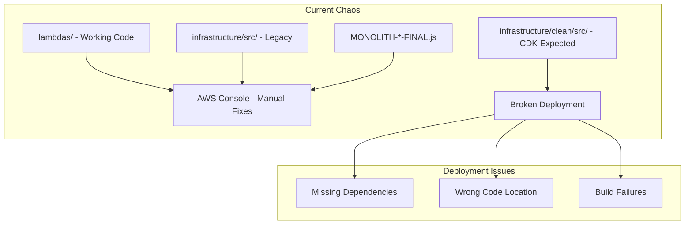
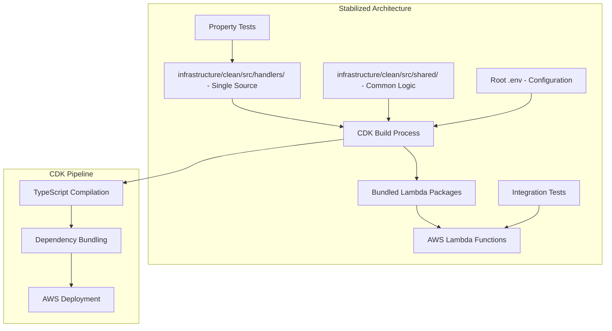
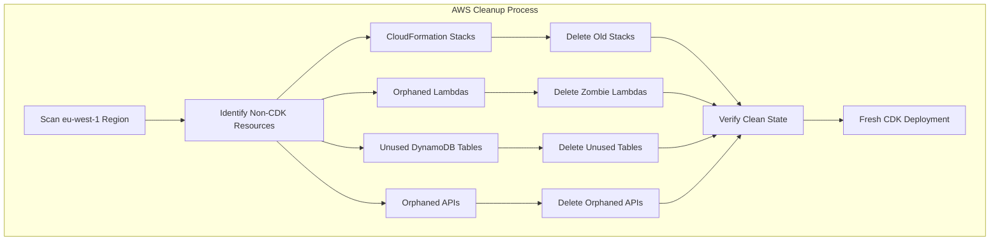

# Design Document: Trinity Architectural Stabilization

## Overview

Trinity Architectural Stabilization transforms the current chaotic codebase into a clean, maintainable architecture with a single source of truth and working CDK deployment pipeline. The design consolidates duplicate code locations, preserves critical business logic from manual console fixes, and establishes proper dependency management while maintaining all existing functionality.

The stabilization follows a phased approach: audit and backup, code consolidation, CDK pipeline repair, dependency resolution, testing validation, and resource cleanup. This ensures zero downtime and preserves the working 50-movie pre-caching system, individual voting logic, and critical TMDB filtering including Japanese/Korean language support.

## Architecture

### Current State Analysis

The Trinity project currently suffers from architectural fragmentation:



### Target Architecture

The stabilized architecture establishes clear separation and single source of truth:



### Code Consolidation Strategy

The design implements a systematic consolidation approach:

1. **AWS Cleanup Phase**: Complete destruction of existing non-CDK resources in eu-west-1
2. **Audit Phase**: Catalog all code locations and identify working versions
3. **Extraction Phase**: Extract critical logic from MONOLITH files into modular TypeScript
4. **Migration Phase**: Move consolidated code to `infrastructure/clean/src/handlers/`
5. **Validation Phase**: Ensure all functionality is preserved through testing
6. **Cleanup Phase**: Remove duplicate and obsolete code locations

### AWS Resource Cleanup Strategy

Before any migration begins, the system must achieve a completely clean AWS state:



**Destructive Cleanup Components:**

1. **CloudFormation Stack Removal**: Delete all non-CDK CloudFormation stacks
2. **Lambda Function Purge**: Remove all Lambda functions not managed by the new CDK
3. **DynamoDB Table Cleanup**: Delete tables not in the documented 12-table list
4. **API Gateway Cleanup**: Remove orphaned API Gateway instances
5. **IAM Role Cleanup**: Remove unused IAM roles and policies
6. **S3 Bucket Cleanup**: Remove deployment artifacts and unused buckets

**Cleanup Validation:**
- Zero Lambda functions exist before CDK deployment
- Zero DynamoDB tables exist before CDK deployment  
- Zero API Gateway instances exist before CDK deployment
- All CloudFormation stacks removed except CDK-managed ones

## Components and Interfaces

### Core Handler Structure

Each Lambda handler follows a standardized interface:

```typescript
interface LambdaHandler {
  handler(event: APIGatewayProxyEvent, context: Context): Promise<APIGatewayProxyResult>;
}

interface HandlerDependencies {
  dynamoClient: DynamoDBDocumentClient;
  tmdbClient: EnhancedTMDBClient;
  filterService: ContentFilterService;
}
```

### Enhanced TMDB Client

The EnhancedTMDBClient preserves critical filtering logic:

```typescript
class EnhancedTMDBClient {
  // Western languages only - NO Asian languages
  private readonly WESTERN_LANGUAGES = ['en', 'es', 'fr', 'it', 'de', 'pt'];
  
  // Genre mapping between Movie and TV endpoints
  private readonly GENRE_MAPPING = {
    28: 10759,  // Action → Action & Adventure
    12: 10759,  // Adventure → Action & Adventure
    37: 37,     // Western → Western
    10752: 10768 // War → War & Politics
  };
  
  async searchContent(params: SearchParams): Promise<TMDBResponse>;
  validateMediaType(mediaType: string): void;
  mapGenreIds(genreIds: number[], targetMediaType: string): number[];
}
```

### Content Filter Service

The ContentFilterService implements business logic validation:

```typescript
class ContentFilterService {
  validateBusinessLogic(item: TMDBItem): boolean;
  hasValidDescription(item: TMDBItem): boolean;
  isWesternLanguage(language: string): boolean;
  meetsQualityGates(item: TMDBItem): boolean;
}
```

### CDK Build System

The CDK build system handles dependency bundling and deployment:

```typescript
interface BuildConfiguration {
  entryPoint: string;
  outputPath: string;
  dependencies: string[];
  runtime: Runtime;
  environment: Record<string, string>;
}

class LambdaBuilder {
  bundleDependencies(config: BuildConfiguration): Promise<void>;
  compileTypeScript(sourcePath: string): Promise<void>;
  packageForDeployment(config: BuildConfiguration): Promise<string>;
}
```

## Data Models

### Lambda Function Metadata

```typescript
interface LambdaFunctionSpec {
  name: string;
  handler: string;
  runtime: Runtime;
  timeout: Duration;
  memorySize: number;
  environment: Record<string, string>;
  dependencies: string[];
  sourceLocation: string;
}
```

### Migration Tracking

```typescript
interface MigrationStatus {
  functionName: string;
  sourceLocation: string;
  targetLocation: string;
  status: 'pending' | 'in-progress' | 'completed' | 'failed';
  backupLocation?: string;
  validationResults?: TestResult[];
}
```

### Dependency Manifest

```typescript
interface DependencyManifest {
  functionName: string;
  requiredPackages: {
    name: string;
    version: string;
    bundled: boolean;
  }[];
  awsSdkModules: string[];
  customModules: string[];
}
```

## Correctness Properties

*A property is a characteristic or behavior that should hold true across all valid executions of a system-essentially, a formal statement about what the system should do. Properties serve as the bridge between human-readable specifications and machine-verifiable correctness guarantees.*

Before defining the correctness properties, I need to analyze the acceptance criteria for testability.

### Converting EARS to Properties

Based on the prework analysis, I'll convert the testable acceptance criteria into universally quantified properties, consolidating redundant ones:

**Property 1: Single Source of Truth Enforcement**
*For any* Lambda function in the Trinity system, there should exist exactly one authoritative source location containing its implementation code
**Validates: Requirements 1.1, 1.2, 1.3, 1.5**

**Property 2: Functionality Preservation During Migration**
*For any* API endpoint or business logic operation, the behavior after consolidation should be functionally equivalent to the behavior before consolidation
**Validates: Requirements 1.4, 3.5**

**Property 3: Successful CDK Build and Deployment**
*For any* CDK deployment operation, the build process should complete without errors and all Lambda functions should be successfully deployed with correct dependencies bundled
**Validates: Requirements 2.1, 2.3, 2.4, 5.1, 5.5**

**Property 4: Post-Deployment Function Validation**
*For any* deployed Lambda function, it should respond correctly to test payloads and maintain operational status
**Validates: Requirements 2.5, 7.5**

**Property 5: Western Languages Preservation**
*For any* TMDB API filtering operation, the language filter should include only western languages (en, es, fr, it, de, pt) and exclude Asian languages
**Validates: Requirements 3.1**

**Property 6: Movie Caching System Integrity**
*For any* room creation operation, the caching system should return exactly 50 movies with correct genre prioritization and TMDB filtering applied
**Validates: Requirements 3.2, 3.3**

**Property 7: Voting System Functionality**
*For any* voting scenario with a given room capacity, match detection should trigger when the required number of users vote "yes" for the same content
**Validates: Requirements 3.4**

**Property 8: Comprehensive Resource Management**
*For any* AWS resource in the Trinity system, it should be either managed by CDK or identified as a zombie resource with removal recommendations
**Validates: Requirements 4.1, 4.2, 4.3, 4.4, 4.5**

**Property 9: Dependency and Runtime Consistency**
*For any* Lambda function requiring external libraries, all dependencies should be correctly bundled and the runtime should be Node.js 18.x
**Validates: Requirements 5.3, 5.4**

**Property 10: Configuration Management Integrity**
*For any* configuration value, it should exist only in the root .env file and be correctly propagated to all Lambda functions during deployment
**Validates: Requirements 6.1, 6.2, 6.3, 6.4**

**Property 11: Pre-Deployment Validation**
*For any* deployment attempt, all required environment variables and dependencies should be validated before deployment proceeds
**Validates: Requirements 5.2, 6.5**

**Property 12: Comprehensive Functionality Testing**
*For any* core system functionality (TMDB integration, caching, voting), the testing system should validate correct operation before and after migration
**Validates: Requirements 7.2, 7.3, 7.4**

**Property 13: Migration Safety and Rollback**
*For any* migration operation, complete backups should exist and rollback procedures should be available if issues occur
**Validates: Requirements 8.1, 8.2, 8.3**

**Property 14: Checkpoint Validation**
*For any* migration checkpoint, functionality validation should complete successfully before proceeding to the next phase
**Validates: Requirements 8.5**

## Error Handling

### Migration Error Recovery

The stabilization process implements comprehensive error handling:

1. **Backup Verification**: Before any migration step, verify complete backups exist
2. **Rollback Triggers**: Automatic rollback on critical failures (build errors, deployment failures)
3. **Checkpoint Validation**: Mandatory validation at each phase before proceeding
4. **Dependency Resolution**: Clear error messages for missing dependencies with resolution steps
5. **Configuration Validation**: Pre-flight checks for all required environment variables

### CDK Pipeline Error Handling

```typescript
interface DeploymentError {
  type: 'build' | 'dependency' | 'deployment' | 'validation';
  message: string;
  rollbackRequired: boolean;
  resolutionSteps: string[];
}

class ErrorHandler {
  handleBuildError(error: BuildError): DeploymentError;
  handleDependencyError(error: DependencyError): DeploymentError;
  initiateRollback(backupLocation: string): Promise<void>;
  validateRecovery(): Promise<boolean>;
}
```

### Business Logic Error Preservation

Critical error handling from MONOLITH fixes must be preserved:

1. **TMDB API Rate Limiting**: Maintain 250ms delay between requests
2. **Language Validation**: Graceful handling of unsupported languages
3. **Genre Mapping**: Error handling for unmapped genre IDs between movie/TV
4. **Cache Validation**: Error recovery for incomplete cache operations
5. **Voting State**: Consistent error handling for invalid voting states

## Testing Strategy

### Dual Testing Approach

The stabilization employs both unit testing and property-based testing for comprehensive coverage:

**Unit Tests Focus:**
- Specific migration scenarios and edge cases
- Configuration validation with missing variables
- Dependency resolution failure scenarios
- Rollback procedure execution
- Integration points between CDK and AWS services

**Property Tests Focus:**
- Universal properties across all Lambda functions (Properties 1-14)
- Comprehensive input coverage through randomization
- Business logic preservation across migration phases
- Resource management consistency
- Configuration propagation correctness

### Property-Based Testing Configuration

- **Testing Library**: fast-check for TypeScript/JavaScript property testing
- **Minimum Iterations**: 100 iterations per property test
- **Test Tagging**: Each property test references its design document property
- **Tag Format**: `Feature: trinity-architectural-stabilization, Property {number}: {property_text}`

### Migration Testing Phases

1. **Pre-Migration Validation**: Test current system functionality
2. **Phase Testing**: Validate each migration phase independently
3. **Integration Testing**: Test complete system after each major phase
4. **Rollback Testing**: Verify rollback procedures work correctly
5. **Post-Migration Validation**: Comprehensive system testing after completion

### Critical Business Logic Testing

Special focus on preserving MONOLITH fixes:

```typescript
// Property test for Western Languages preservation
test('Feature: trinity-architectural-stabilization, Property 5: Western Languages Preservation', () => {
  fc.assert(fc.property(
    fc.oneof(fc.constant('MOVIE'), fc.constant('TV')),
    fc.array(fc.integer(1, 50)),
    (mediaType, genreIds) => {
      const client = new EnhancedTMDBClient();
      const params = client.buildSearchParams({ mediaType, genreIds });
      expect(params.get('with_original_language')).toBe('en|es|fr|it|de|pt');
    }
  ));
});

// Property test for 50-movie caching with graceful shortage handling
test('Feature: trinity-architectural-stabilization, Property 6: Movie Caching System Integrity', () => {
  fc.assert(fc.property(
    fc.record({
      mediaType: fc.oneof(fc.constant('MOVIE'), fc.constant('TV')),
      genreIds: fc.array(fc.integer(1, 50), { minLength: 1, maxLength: 2 })
    }),
    async (roomConfig) => {
      const cacheService = new CacheService();
      const result = await cacheService.generateRoomCache(roomConfig);
      // Accept fewer than 50 items if western-only filtering results in shortage
      expect(result.movies.length).toBeLessThanOrEqual(50);
      expect(result.movies.length).toBeGreaterThan(0);
      expect(result.movies.every(movie => movie.overview && movie.overview.trim().length > 0)).toBe(true);
      // Ensure no mixing of Movie/TV types
      const mediaTypes = new Set(result.movies.map(movie => movie.media_type || roomConfig.mediaType));
      expect(mediaTypes.size).toBe(1);
    }
  ));
});
```

The testing strategy ensures that all critical functionality is preserved while providing confidence in the architectural stabilization process.