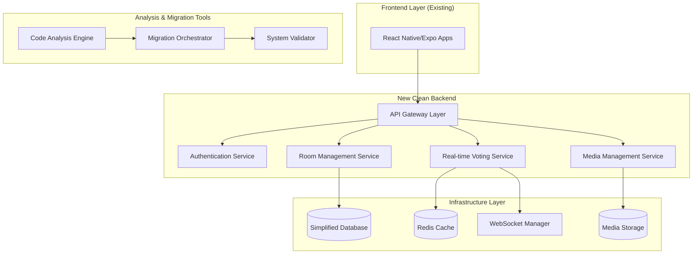

# Design Document: Trinity Complete Refactoring

## Overview

Trinity es un sistema complejo de salas de películas con votaciones en tiempo real que requiere una refactorización completa desde cero. El diseño propuesto implementa una arquitectura hexagonal limpia que separa claramente las responsabilidades, elimina la deuda técnica acumulada, y simplifica la infraestructura AWS mientras mantiene todas las funcionalidades críticas.

La estrategia de refactorización se basa en tres pilares fundamentales:
1. **Análisis Exhaustivo**: Mapeo completo del sistema actual para entender qué preservar
2. **Arquitectura Limpia**: Implementación desde cero usando patrones modernos y mejores prácticas
3. **Migración Controlada**: Transición gradual con validación en cada paso y eliminación completa del código legacy

## Architecture

### High-Level Architecture



### Architectural Principles

**Hexagonal Architecture (Ports & Adapters)**
- Core business logic isolated from external concerns
- Clear separation between domain, application, and infrastructure layers
- Dependency inversion ensuring testability and flexibility

**Real-time Communication Strategy**
- WebSocket-based architecture for low-latency voting updates
- Event-driven design for room state synchronization
- Horizontal scaling support through Redis pub/sub

**Infrastructure Simplification**
- Reduced AWS service footprint compared to current implementation
- Container-based deployment for better resource utilization
- Infrastructure as Code with simplified CDK patterns

## Components and Interfaces

### Core Domain Services

#### Analysis Engine
**Purpose**: Comprehensive analysis of existing codebase and infrastructure

**Key Responsibilities**:
- Repository scanning and dependency mapping
- Infrastructure resource cataloging
- Feature functionality extraction
- Legacy code identification

**Interfaces**:
```typescript
interface IAnalysisEngine {
  scanRepository(path: string): Promise<RepositoryAnalysis>
  analyzeInfrastructure(cdkPath: string): Promise<InfrastructureAnalysis>
  extractFeatures(codebase: Codebase): Promise<FeatureMap>
  identifyObsoleteComponents(analysis: SystemAnalysis): Promise<ObsoleteComponents>
}

interface RepositoryAnalysis {
  modules: ModuleInfo[]
  dependencies: DependencyGraph
  configurations: ConfigurationFiles[]
  testCoverage: CoverageReport
}
```

#### Room Management Service
**Purpose**: Handle movie room creation, management, and participant coordination

**Key Responsibilities**:
- Room lifecycle management (create, configure, close)
- Participant management and permissions
- Movie selection and playlist management
- Room state persistence and recovery

**Interfaces**:
```typescript
interface IRoomService {
  createRoom(config: RoomConfiguration): Promise<Room>
  joinRoom(roomId: string, userId: string): Promise<RoomMembership>
  updateRoomSettings(roomId: string, settings: RoomSettings): Promise<void>
  getRoomState(roomId: string): Promise<RoomState>
}

interface Room {
  id: string
  name: string
  ownerId: string
  participants: Participant[]
  currentMovie?: Movie
  votingSession?: VotingSession
  settings: RoomSettings
}
```

#### Real-time Voting Service
**Purpose**: Manage voting sessions with real-time updates and synchronization

**Key Responsibilities**:
- Voting session orchestration
- Real-time vote collection and broadcasting
- Vote validation and conflict resolution
- Results calculation and persistence

**Interfaces**:
```typescript
interface IVotingService {
  startVotingSession(roomId: string, options: VotingOptions): Promise<VotingSession>
  castVote(sessionId: string, userId: string, vote: Vote): Promise<VoteResult>
  getVotingResults(sessionId: string): Promise<VotingResults>
  subscribeToVotingUpdates(sessionId: string): Observable<VotingUpdate>
}

interface VotingSession {
  id: string
  roomId: string
  type: VotingType
  options: VotingOption[]
  votes: Map<string, Vote>
  status: VotingStatus
  startTime: Date
  endTime?: Date
}
```

#### Authentication Service
**Purpose**: Maintain existing Google/Cognito authentication while simplifying implementation

**Key Responsibilities**:
- Google OAuth integration
- Cognito user management
- JWT token validation
- Session management

**Interfaces**:
```typescript
interface IAuthService {
  authenticateWithGoogle(token: string): Promise<AuthResult>
  validateJWT(token: string): Promise<UserContext>
  refreshToken(refreshToken: string): Promise<TokenPair>
  getUserProfile(userId: string): Promise<UserProfile>
}

interface AuthResult {
  user: UserProfile
  tokens: TokenPair
  isNewUser: boolean
}
```

### Infrastructure Components

#### WebSocket Manager
**Purpose**: Handle real-time communication with horizontal scaling support

**Key Features**:
- Connection lifecycle management
- Room-based message broadcasting
- Redis pub/sub for multi-instance coordination
- Automatic reconnection handling

#### Migration Orchestrator
**Purpose**: Coordinate the systematic migration from legacy to new implementation

**Key Responsibilities**:
- Phase-based migration execution
- Data migration with validation
- Rollback capability management
- Progress tracking and reporting

**Interfaces**:
```typescript
interface IMigrationOrchestrator {
  executeMigrationPhase(phase: MigrationPhase): Promise<MigrationResult>
  validateMigrationStep(step: MigrationStep): Promise<ValidationResult>
  rollbackToPhase(phase: MigrationPhase): Promise<RollbackResult>
  getMigrationProgress(): Promise<MigrationProgress>
}
```

## Data Models

### Core Entities

#### User
```typescript
interface User {
  id: string
  email: string
  displayName: string
  avatarUrl?: string
  googleId: string
  cognitoId: string
  preferences: UserPreferences
  createdAt: Date
  lastActiveAt: Date
}
```

#### Room
```typescript
interface Room {
  id: string
  name: string
  description?: string
  ownerId: string
  participants: Participant[]
  settings: RoomSettings
  currentSession?: Session
  createdAt: Date
  updatedAt: Date
}

interface RoomSettings {
  isPublic: boolean
  maxParticipants: number
  allowGuestVoting: boolean
  votingTimeLimit?: number
  requireApprovalToJoin: boolean
}
```

#### Voting Session
```typescript
interface VotingSession {
  id: string
  roomId: string
  type: 'movie_selection' | 'rating' | 'custom'
  title: string
  options: VotingOption[]
  votes: Vote[]
  status: 'pending' | 'active' | 'completed' | 'cancelled'
  startTime: Date
  endTime?: Date
  results?: VotingResults
}

interface Vote {
  id: string
  sessionId: string
  userId: string
  optionId: string
  timestamp: Date
  weight: number
}
```

#### Movie
```typescript
interface Movie {
  id: string
  title: string
  description: string
  posterUrl?: string
  trailerUrl?: string
  duration: number
  genre: string[]
  releaseYear: number
  rating?: number
  addedBy: string
  addedAt: Date
}
```

### Migration Data Models

#### System Analysis
```typescript
interface SystemAnalysis {
  repository: RepositoryAnalysis
  infrastructure: InfrastructureAnalysis
  features: FeatureAnalysis
  dependencies: DependencyAnalysis
  obsoleteComponents: ObsoleteComponent[]
}

interface FeatureAnalysis {
  coreFeatures: Feature[]
  deprecatedFeatures: Feature[]
  missingFeatures: Feature[]
  featureComplexity: Map<string, ComplexityMetrics>
}
```

#### Migration Plan
```typescript
interface MigrationPlan {
  phases: MigrationPhase[]
  dependencies: PhaseDependency[]
  rollbackStrategies: RollbackStrategy[]
  validationCriteria: ValidationCriteria[]
  estimatedDuration: Duration
}

interface MigrationPhase {
  id: string
  name: string
  description: string
  tasks: MigrationTask[]
  prerequisites: string[]
  successCriteria: string[]
  rollbackProcedure: RollbackProcedure
}
```

## Correctness Properties

*A property is a characteristic or behavior that should hold true across all valid executions of a system—essentially, a formal statement about what the system should do. Properties serve as the bridge between human-readable specifications and machine-verifiable correctness guarantees.*

### Property 1: Comprehensive Code Analysis
*For any* repository structure containing NestJS modules, React Native components, configuration files, and CDK resources, the Analysis Engine should identify and catalog all source code, dependencies, and infrastructure components without missing any critical elements.
**Validates: Requirements 1.1, 1.2, 1.3, 1.4, 1.5**

### Property 2: Obsolete Component Detection
*For any* codebase with unused dependencies, dead code, or redundant infrastructure, the Analysis Engine should correctly identify all obsolete components that can be safely removed.
**Validates: Requirements 1.6, 5.1**

### Property 3: Feature Mapping Accuracy
*For any* existing system functionality, the Analysis Engine should create accurate mappings between current implementation and required features, ensuring no critical functionality is lost during refactoring.
**Validates: Requirements 1.7, 2.1, 2.2, 2.3, 2.4, 2.5**

### Property 4: Feature Prioritization Consistency
*For any* set of features with defined user impact and technical complexity metrics, the Analysis Engine should produce consistent prioritization rankings that properly balance impact and complexity.
**Validates: Requirements 2.6**

### Property 5: Infrastructure Optimization
*For any* current AWS infrastructure setup, the new Clean Architecture should use fewer services while maintaining all required functionality and performance characteristics.
**Validates: Requirements 3.4, 5.2, 5.4**

### Property 6: API Compatibility Preservation
*For any* existing mobile application API calls, the new backend implementation should maintain compatibility, allowing existing frontend applications to function without modification.
**Validates: Requirements 3.5, 4.2, 4.4, 4.5**

### Property 7: Migration Plan Completeness
*For any* system component requiring migration, the Migration Plan should include incremental phases, dependency mapping, rollback procedures, and validation steps.
**Validates: Requirements 3.6, 4.3, 5.3, 6.1, 6.2, 6.3, 6.4**

### Property 8: Data Preservation During Migration
*For any* user data in the current system, the migration procedures should preserve all data integrity and accessibility throughout the refactoring process.
**Validates: Requirements 6.5**

### Property 9: Monitoring and Validation Coverage
*For any* migration phase, the Migration Plan should specify comprehensive monitoring and validation procedures to ensure successful completion.
**Validates: Requirements 6.6**

### Property 10: Code Quality Standards Compliance
*For any* newly implemented code, the system should automatically enforce consistent coding standards, achieve specified test coverage thresholds, and pass all quality checks.
**Validates: Requirements 7.1, 7.3, 7.6**

### Property 11: Documentation Completeness
*For any* API endpoint or architectural component, the system should include comprehensive documentation that meets completeness criteria.
**Validates: Requirements 7.2**

### Property 12: Real-time Synchronization
*For any* room state change or voting action, all connected participants should receive updates within acceptable latency thresholds, maintaining real-time user experience.
**Validates: Requirements 8.1, 8.2, 8.3**

### Property 13: Connection Resilience
*For any* network interruption or connection failure, the system should automatically reconnect and synchronize state without data loss or inconsistency.
**Validates: Requirements 8.4**

### Property 14: Capacity Preservation
*For any* concurrent user load that the current system supports, the new implementation should handle the same or greater capacity without performance degradation.
**Validates: Requirements 8.5**

### Property 15: Analytics and History Preservation
*For any* voting session or room activity, the system should maintain complete history and provide analytics capabilities equivalent to or better than the current implementation.
**Validates: Requirements 8.6**

### Property 16: Complete Legacy Elimination
*For any* legacy code, infrastructure, or dependency identified for removal, the cleanup procedures should eliminate all traces without leaving orphaned references or unused resources.
**Validates: Requirements 9.2, 9.3, 9.4, 9.6**

### Property 17: Post-Migration Validation
*For any* system functionality after legacy cleanup, comprehensive validation should confirm that all features work correctly in the clean implementation.
**Validates: Requirements 9.1, 9.5**

## Error Handling

### Analysis Phase Error Handling

**Repository Access Errors**
- Graceful handling of permission issues, missing files, or corrupted repositories
- Detailed error reporting with specific file paths and access issues
- Fallback mechanisms for partial analysis when complete access is unavailable

**Infrastructure Analysis Errors**
- AWS credential and permission validation before analysis
- Handling of deprecated or inaccessible CDK resources
- Error recovery for malformed CloudFormation templates

**Feature Extraction Errors**
- Robust parsing of complex codebases with syntax errors
- Handling of incomplete or legacy code patterns
- Graceful degradation when automated analysis is insufficient

### Migration Phase Error Handling

**Data Migration Errors**
- Comprehensive backup procedures before any data migration
- Transaction-based migration with rollback capabilities
- Data validation and integrity checks at each migration step
- Detailed logging of all migration operations for audit trails

**Infrastructure Migration Errors**
- Blue-green deployment strategies to minimize downtime
- Automated rollback triggers based on health checks
- Resource dependency validation before infrastructure changes
- Cost monitoring to prevent unexpected charges during migration

**Real-time Service Errors**
- WebSocket connection failure handling with automatic reconnection
- Message queue persistence for temporary service interruptions
- State synchronization recovery after network partitions
- Graceful degradation to polling when WebSocket unavailable

### Runtime Error Handling

**Authentication Errors**
- Token refresh handling for expired credentials
- Fallback authentication methods when primary services fail
- Session recovery after temporary authentication service outages
- Clear error messages for authentication failures

**Voting System Errors**
- Vote validation and duplicate prevention
- Conflict resolution for simultaneous votes
- Recovery from partial vote submissions
- Audit trails for all voting operations

## Testing Strategy

### Dual Testing Approach

The Trinity refactoring requires both **unit testing** and **property-based testing** to ensure comprehensive coverage and correctness validation.

**Unit Testing Focus**:
- Specific examples of analysis engine behavior with known codebases
- Integration points between migration components
- Edge cases in voting and room management
- Authentication flow validation with mock services
- Error conditions and recovery scenarios

**Property-Based Testing Focus**:
- Universal properties that hold across all valid inputs
- Comprehensive input coverage through randomization
- System behavior validation under various conditions
- Migration process correctness across different system states

### Property-Based Testing Configuration

**Testing Framework**: We will use **fast-check** for TypeScript/Node.js property-based testing, configured with:
- Minimum **100 iterations** per property test
- Custom generators for domain-specific data (rooms, users, votes)
- Shrinking capabilities to find minimal failing examples
- Deterministic seeding for reproducible test runs

**Property Test Tagging**:
Each property-based test must include a comment referencing its design document property:
```typescript
// Feature: trinity-complete-refactoring, Property 1: Comprehensive Code Analysis
```

**Test Categories**:

1. **Analysis Engine Properties** (Properties 1-4)
   - Repository structure generation and analysis validation
   - Feature extraction accuracy across different codebases
   - Obsolete component detection with known unused code

2. **Architecture Properties** (Properties 5-7)
   - Infrastructure optimization validation
   - API compatibility testing with generated endpoints
   - Migration plan completeness verification

3. **Data and Migration Properties** (Properties 8-9)
   - Data preservation across migration scenarios
   - Monitoring coverage validation for all migration phases

4. **Code Quality Properties** (Properties 10-11)
   - Automated quality standard enforcement
   - Documentation completeness verification

5. **Real-time System Properties** (Properties 12-15)
   - Real-time synchronization under various network conditions
   - Connection resilience with simulated failures
   - Capacity testing with generated user loads
   - Analytics accuracy with generated voting data

6. **Legacy Cleanup Properties** (Properties 16-17)
   - Complete elimination verification
   - Post-cleanup functionality validation

### Integration Testing Strategy

**Migration Phase Testing**:
- End-to-end migration simulation with test data
- Rollback procedure validation at each phase
- Performance benchmarking before and after migration
- User acceptance testing with existing mobile applications

**Real-time System Testing**:
- Load testing with concurrent users and voting sessions
- Network partition simulation and recovery testing
- WebSocket connection stress testing
- Cross-platform compatibility validation

### Continuous Integration Requirements

**Automated Quality Gates**:
- All property tests must pass with 100+ iterations
- Code coverage minimum 85% for critical components
- Static analysis compliance for all new code
- Performance regression detection
- Security vulnerability scanning

**Migration Validation Pipeline**:
- Automated migration testing in isolated environments
- Data integrity validation after each migration step
- Infrastructure cost analysis and optimization verification
- Rollback procedure testing and validation