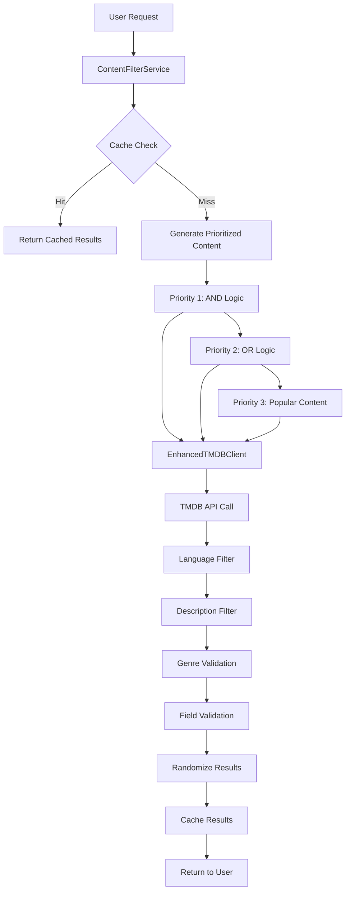

# 🔧 DOCUMENTACIÓN TÉCNICA - SISTEMA DE FILTRADO AVANZADO

## 📋 ÍNDICE
1. [Arquitectura del Sistema](#arquitectura-del-sistema)
2. [Flujo de Datos](#flujo-de-datos)
3. [Implementación Detallada](#implementación-detallada)
4. [Configuración y Despliegue](#configuración-y-despliegue)
5. [Testing y Validación](#testing-y-validación)
6. [Troubleshooting](#troubleshooting)

---

## 🏗️ ARQUITECTURA DEL SISTEMA

### Componentes Principales

```
┌─────────────────────────────────────────────────────────────┐
│                    TRINITY FILTERING SYSTEM                 │
├─────────────────────────────────────────────────────────────┤
│  ┌─────────────────┐  ┌─────────────────┐  ┌──────────────┐ │
│  │   Mobile App    │  │   Web Client    │  │  GraphQL API │ │
│  │                 │  │                 │  │              │ │
│  └─────────┬───────┘  └─────────┬───────┘  └──────┬───────┘ │
│            │                    │                 │         │
│            └────────────────────┼─────────────────┘         │
│                                 │                           │
├─────────────────────────────────┼───────────────────────────┤
│                    ┌────────────▼──────────────┐            │
│                    │     AWS Lambda            │            │
│                    │   trinity-movie-dev       │            │
│                    └────────────┬──────────────┘            │
│                                 │                           │
│  ┌─────────────────────────────────────────────────────────┐ │
│  │              FILTERING PIPELINE                         │ │
│  │                                                         │ │
│  │  ┌─────────────────┐  ┌─────────────────┐  ┌─────────┐ │ │
│  │  │ ContentFilter   │  │ EnhancedTMDB    │  │Priority │ │ │
│  │  │ Service         │  │ Client          │  │Algorithm│ │ │
│  │  │                 │  │                 │  │         │ │ │
│  │  └─────────┬───────┘  └─────────┬───────┘  └────┬────┘ │ │
│  │            │                    │                │      │ │
│  │            └────────────────────┼────────────────┘      │ │
│  │                                 │                       │ │
│  └─────────────────────────────────┼───────────────────────┘ │
│                                    │                         │
├────────────────────────────────────┼─────────────────────────┤
│                       ┌────────────▼──────────────┐          │
│                       │        TMDB API           │          │
│                       │   (External Service)      │          │
│                       └───────────────────────────┘          │
└─────────────────────────────────────────────────────────────┘
```

### Capas de Filtrado

```
┌─────────────────────────────────────────────────────────────┐
│                    FILTERING LAYERS                         │
├─────────────────────────────────────────────────────────────┤
│                                                             │
│  ┌─────────────────────────────────────────────────────────┐ │
│  │  LAYER 1: TMDB API FILTERING                           │ │
│  │  • Genre filtering (with_genres parameter)             │ │
│  │  • Language: es-ES                                     │ │
│  │  • Adult content: false                                │ │
│  │  • Minimum vote count: 5                               │ │
│  └─────────────────────────────────────────────────────────┘ │
│                              │                               │
│                              ▼                               │
│  ┌─────────────────────────────────────────────────────────┐ │
│  │  LAYER 2: LANGUAGE FILTERING                           │ │
│  │  • Western languages only: es, en, fr, it, pt, de      │ │
│  │  • Filters out: ar, ko, ja, zh, hi, etc.              │ │
│  └─────────────────────────────────────────────────────────┘ │
│                              │                               │
│                              ▼                               │
│  ┌─────────────────────────────────────────────────────────┐ │
│  │  LAYER 3: DESCRIPTION FILTERING                        │ │
│  │  • Must have overview field                            │ │
│  │  • Must be string type                                 │ │
│  │  • Minimum 30 characters after trim                    │ │
│  └─────────────────────────────────────────────────────────┘ │
│                              │                               │
│                              ▼                               │
│  ┌─────────────────────────────────────────────────────────┐ │
│  │  LAYER 4: GENRE VALIDATION                             │ │
│  │  • AND logic: "16,35" (must have both)                 │ │
│  │  • OR logic: "16|35" (must have either)                │ │
│  │  • Single genre: "35" (must have this one)             │ │
│  └─────────────────────────────────────────────────────────┘ │
│                              │                               │
│                              ▼                               │
│  ┌─────────────────────────────────────────────────────────┐ │
│  │  LAYER 5: FIELD VALIDATION                             │ │
│  │  • Required fields: id, genre_ids, vote_average        │ │
│  │  • Title: title OR name must exist                     │ │
│  │  • Release date: release_date OR first_air_date        │ │
│  └─────────────────────────────────────────────────────────┘ │
│                              │                               │
│                              ▼                               │
│                    FILTERED RESULTS                          │
└─────────────────────────────────────────────────────────────┘
```

---

## 🔄 FLUJO DE DATOS

### 1. Flujo Principal de Filtrado



### 2. Flujo de Prioridades

```
Priority 1 (AND Logic):
┌─────────────────────────────────────────────────────────────┐
│ User selects: Animation (16) + Comedy (35)                 │
│ Query: "16,35"                                              │
│ Logic: Movie must have BOTH genres                         │
│ Sort: vote_average.desc                                     │
│ Limit: Up to 30 items                                      │
└─────────────────────────────────────────────────────────────┘
                              │
                              ▼
┌─────────────────────────────────────────────────────────────┐
│ If Priority 1 < 30 items → Continue to Priority 2          │
└─────────────────────────────────────────────────────────────┘
                              │
                              ▼
Priority 2 (OR Logic):
┌─────────────────────────────────────────────────────────────┐
│ Separate calls for each genre:                             │
│ Call 1: "16" (Animation only)                              │
│ Call 2: "35" (Comedy only)                                 │
│ Logic: Movie must have AT LEAST ONE genre                  │
│ Exclude: Items that already have BOTH genres               │
│ Sort: popularity.desc                                       │
│ Limit: Fill remaining slots to reach 30                    │
└─────────────────────────────────────────────────────────────┘
                              │
                              ▼
┌─────────────────────────────────────────────────────────────┐
│ If Priority 1 + 2 < 30 items → Continue to Priority 3      │
└─────────────────────────────────────────────────────────────┘
                              │
                              ▼
Priority 3 (Popular Fallback):
┌─────────────────────────────────────────────────────────────┐
│ No genre filtering                                          │
│ Sort: popularity.desc                                       │
│ Limit: Fill remaining slots to reach 30                    │
└─────────────────────────────────────────────────────────────┘
```

---

## 💻 IMPLEMENTACIÓN DETALLADA

### 1. EnhancedTMDBClient - Filtrado de Idiomas

```javascript
// Implementación del filtrado de idiomas occidentales
results = results.filter(item => {
    const originalLang = item.original_language;
    const westernLanguages = ['es', 'en', 'fr', 'it', 'pt', 'de'];
    const isWesternLanguage = westernLanguages.includes(originalLang);
    
    if (!isWesternLanguage) {
        console.log(`❌ TMDB: Filtering out non-western language: ${item.title || item.name} (${originalLang})`);
    }
    
    return isWesternLanguage;
});
console.log(`🔍 TMDB: After language filtering: ${results.length} items`);
```

**Detalles de Implementación**:
- **Input**: Array de elementos de TMDB con campo `original_language`
- **Process**: Compara cada idioma contra lista de idiomas occidentales permitidos
- **Output**: Array filtrado solo con contenido en idiomas occidentales
- **Logging**: Registra cada elemento filtrado con su idioma original

### 2. EnhancedTMDBClient - Filtrado de Descripciones

```javascript
// Implementación del filtrado de descripciones significativas
results = results.filter(item => {
    const overview = item.overview;
    const hasValidDescription = overview && 
                              typeof overview === 'string' && 
                              overview.trim().length >= 30;
    
    if (!hasValidDescription) {
        console.log(`❌ TMDB: Filtering out item without description: ${item.title || item.name} (overview length: ${overview ? overview.trim().length : 0})`);
    }
    
    return hasValidDescription;
});
console.log(`🔍 TMDB: After description filtering: ${results.length} items`);
```

**Criterios de Validación**:
1. **Existencia**: `overview` no debe ser null o undefined
2. **Tipo**: Debe ser string válido
3. **Longitud**: Mínimo 30 caracteres después de `trim()`
4. **Logging**: Registra longitud exacta de descripciones inválidas

### 3. ContentFilterService - Algoritmo de Prioridades

```javascript
// Priority 1: Content with ALL selected genres (AND logic)
if (criteria.genres.length > 0) {
    console.log(`🥇 Priority 1: Fetching content with ALL genres [${criteria.genres.join(',')}]`);
    
    // Fetch multiple pages for better randomization
    let allGenresContent = [];
    const maxPages = 10;
    
    for (let page = 1; page <= maxPages; page++) {
        const pageContent = await this.tmdbClient.discoverContent({
            mediaType: criteria.mediaType,
            withGenres: criteria.genres.join(','), // Comma-separated for AND logic
            sortBy: 'vote_average.desc',
            excludeIds,
            page
        });
        
        if (pageContent.length === 0) break;
        
        // Double-check genre validation on client side
        const validatedContent = pageContent.filter(item => {
            const itemGenres = item.genre_ids || [];
            const hasAllGenres = criteria.genres.every(genreId => itemGenres.includes(genreId));
            return hasAllGenres;
        });
        
        allGenresContent.push(...validatedContent);
        if (allGenresContent.length >= 50) break; // Stop if enough for randomization
    }
    
    const priority1Items = this.priorityAlgorithm.randomizeContent(allGenresContent)
        .slice(0, 30)
        .map(item => this.mapToContentPoolEntry(item, 1, now));
    results.push(...priority1Items);
}
```

**Características del Algoritmo**:
- **Paginación**: Hasta 10 páginas para mejor randomización
- **Validación doble**: Cliente valida géneros además del servidor TMDB
- **Límite inteligente**: Para cuando tiene suficiente contenido (50+ items)
- **Randomización**: Aplica algoritmo de randomización antes de seleccionar 30

### 4. Mapeo de Datos

```javascript
mapToContentPoolEntry(tmdbItem, priority, addedAt) {
    return {
        tmdbId: tmdbItem.id.toString(),
        mediaType: tmdbItem.media_type || 'MOVIE',
        title: tmdbItem.title || tmdbItem.name,
        posterPath: tmdbItem.poster_path ? `https://image.tmdb.org/t/p/w500${tmdbItem.poster_path}` : undefined,
        overview: tmdbItem.overview || '',
        genreIds: tmdbItem.genre_ids || [],
        voteAverage: tmdbItem.vote_average || 0,
        releaseDate: tmdbItem.release_date || tmdbItem.first_air_date || '',
        priority,
        addedAt: addedAt.toISOString()
    };
}
```

**Transformaciones Aplicadas**:
- **ID**: Convierte a string para consistencia
- **Título**: Usa `title` para películas, `name` para series
- **Poster**: Construye URL completa con CDN de TMDB
- **Fecha**: Usa `release_date` para películas, `first_air_date` para series
- **Timestamp**: Formato ISO para compatibilidad con DynamoDB

---

## ⚙️ CONFIGURACIÓN Y DESPLIEGUE

### 1. Estructura de Archivos

```
trinity_tfg/
├── lambda-package-final/           # ✅ Archivos actualizados
│   ├── movie.js                   # Handler principal
│   ├── services/
│   │   ├── enhanced-tmdb-client.js    # Cliente TMDB con filtrado
│   │   ├── content-filter-service.js  # Servicio orquestador
│   │   ├── priority-algorithm.js      # Algoritmo de prioridades
│   │   └── filter-cache-manager.js    # Gestión de caché
│   ├── types/
│   │   └── content-filtering-types.js # Definiciones de tipos
│   └── utils/
│       └── metrics.js                 # Métricas y logging
├── infrastructure/src/             # ❌ Archivos antiguos (no usar)
│   └── ...
└── deploy-lambda-only.js          # ✅ Script de despliegue corregido
```

### 2. Script de Despliegue Corregido

```javascript
// Configuración corregida en deploy-lambda-only.js
async function createDeploymentPackage() {
    return new Promise((resolve, reject) => {
        const output = [];
        const archive = archiver('zip', { zlib: { level: 9 } });
        
        // ✅ CORRECTO: Usar lambda-package-final
        archive.file('lambda-package-final/movie.js', { name: 'movie.js' });
        
        const servicesDir = 'lambda-package-final/services';
        if (fs.existsSync(servicesDir)) {
            const serviceFiles = fs.readdirSync(servicesDir);
            serviceFiles.forEach(file => {
                if (file.endsWith('.js')) {
                    archive.file(path.join(servicesDir, file), { name: `services/${file}` });
                }
            });
        }
        
        // Similar para types/ y utils/
        archive.finalize();
    });
}
```

### 3. Variables de Entorno

```javascript
// Variables requeridas en Lambda
const requiredEnvVars = {
    TMDB_API_KEY: process.env.TMDB_API_KEY,           // API key de TMDB
    AWS_REGION: process.env.AWS_REGION,               // Región de AWS
    FILTER_CACHE_TABLE: 'trinity-filter-cache'       // Tabla de caché
};
```

### 4. Configuración de AWS Lambda

```json
{
    "FunctionName": "trinity-movie-dev",
    "Runtime": "nodejs18.x",
    "Handler": "movie.handler",
    "MemorySize": 512,
    "Timeout": 30,
    "Environment": {
        "Variables": {
            "TMDB_API_KEY": "your-tmdb-api-key",
            "NODE_ENV": "production"
        }
    }
}
```

---

## 🧪 TESTING Y VALIDACIÓN

### 1. Test de Filtrado Simple

```javascript
// test-simple-filtering.js
const payload = {
    info: { fieldName: 'getFilteredContent' },
    arguments: {
        mediaType: 'MOVIE',
        genreIds: [35], // Solo Comedia
        limit: 5,
        excludeIds: []
    }
};

// Validaciones esperadas:
// ✅ Todos los resultados deben tener descripción (30+ chars)
// ✅ Todos los resultados deben estar en idiomas occidentales
// ✅ Logs deben mostrar filtrado activo
```

### 2. Test de Géneros Múltiples

```javascript
// test-complete-genre-mapping.js
const payload = {
    info: { fieldName: 'getFilteredContent' },
    arguments: {
        mediaType: 'MOVIE',
        genreIds: [16, 35], // Animación + Comedia
        limit: 10,
        excludeIds: []
    }
};

// Validaciones esperadas:
// ✅ Priority 1: Películas con AMBOS géneros (16 Y 35)
// ✅ Priority 2: Películas con CUALQUIER género (16 O 35)
// ✅ Priority 3: Películas populares (si es necesario)
```

### 3. Validación de Logs

```bash
# Buscar evidencia de filtrado en logs
grep "After language filtering" logs.txt
grep "After description filtering" logs.txt
grep "Priority 1:" logs.txt
grep "Priority 2:" logs.txt
```

### 4. Métricas de Calidad

```javascript
// Validación automática de resultados
function validateResults(results) {
    const validations = {
        hasDescription: results.every(r => r.overview && r.overview.length >= 30),
        westernLanguages: results.every(r => ['es', 'en', 'fr', 'it', 'pt', 'de'].includes(r.original_language)),
        hasRequiredFields: results.every(r => r.id && r.title && r.genre_ids),
        noDuplicates: new Set(results.map(r => r.id)).size === results.length
    };
    
    return validations;
}
```

---

## 🔧 TROUBLESHOOTING

### 1. Problemas Comunes

#### Problema: "Filtros no se aplican"
```
Síntomas:
- Películas sin descripción en resultados
- Idiomas no occidentales presentes
- Logs sin mensajes de filtrado

Causa: Script de despliegue usando archivos antiguos
Solución: Verificar que deploy-lambda-only.js use lambda-package-final/

Verificación:
grep "lambda-package-final" deploy-lambda-only.js
```

#### Problema: "Error de permisos DynamoDB"
```
Error: AccessDeniedException: User is not authorized to perform: dynamodb:PutItem

Causa: Lambda no tiene permisos para escribir en tabla de caché
Impacto: Funcionalidad principal no afectada (caché es opcional)
Solución: Actualizar política IAM del rol de Lambda

Política requerida:
{
    "Version": "2012-10-17",
    "Statement": [
        {
            "Effect": "Allow",
            "Action": [
                "dynamodb:PutItem",
                "dynamodb:GetItem",
                "dynamodb:UpdateItem",
                "dynamodb:DeleteItem"
            ],
            "Resource": "arn:aws:dynamodb:*:*:table/trinity-filter-cache"
        }
    ]
}
```

#### Problema: "Rate limiting de TMDB"
```
Error: TMDB API error: 429 Too Many Requests

Causa: Demasiadas peticiones a TMDB API
Solución automática: Sistema implementa backoff exponencial
Configuración: RATE_LIMIT_DELAY = 250ms (4 requests/second)

Monitoreo:
grep "Rate limiting" logs.txt
grep "Exponential backoff" logs.txt
```

### 2. Comandos de Diagnóstico

```bash
# Verificar despliegue
aws lambda get-function --function-name trinity-movie-dev

# Ver logs en tiempo real
aws logs tail /aws/lambda/trinity-movie-dev --follow

# Probar función directamente
aws lambda invoke --function-name trinity-movie-dev \
  --payload '{"info":{"fieldName":"getFilteredContent"},"arguments":{"mediaType":"MOVIE","genreIds":[35],"limit":5}}' \
  response.json

# Verificar archivos en paquete desplegado
unzip -l movie-handler.zip
```

### 3. Validación de Configuración

```javascript
// Script de validación de configuración
async function validateConfiguration() {
    const checks = {
        tmdbApiKey: !!process.env.TMDB_API_KEY,
        awsRegion: !!process.env.AWS_REGION,
        lambdaFunction: await checkLambdaExists('trinity-movie-dev'),
        tmdbConnectivity: await testTmdbConnection(),
        filteringLogic: await testFilteringLogic()
    };
    
    console.log('Configuration validation:', checks);
    return Object.values(checks).every(Boolean);
}
```

### 4. Logs de Debug Importantes

```javascript
// Mensajes clave a buscar en logs
const debugMessages = [
    "🚨 DEBUG: ENHANCED TMDB CLIENT WITH STRICT FILTERING ACTIVE 🚨",
    "🔍 TMDB: Raw results from API:",
    "🔍 TMDB: After language filtering:",
    "🔍 TMDB: After description filtering:",
    "🥇 Priority 1: STARTING",
    "🥈 Priority 2:",
    "🥉 Priority 3:",
    "📊 Priority distribution:"
];
```

---

## 📊 MÉTRICAS Y MONITOREO

### 1. Métricas de Rendimiento

```javascript
// Métricas implementadas
const metrics = {
    filteringLatency: 'Tiempo total de filtrado',
    tmdbApiCalls: 'Número de llamadas a TMDB API',
    cacheHitRate: 'Porcentaje de aciertos en caché',
    filteredItemsCount: 'Número de elementos filtrados',
    priorityDistribution: 'Distribución por prioridades'
};
```

### 2. Alertas Recomendadas

```yaml
# CloudWatch Alarms
FilteringLatencyHigh:
  MetricName: Duration
  Threshold: 5000  # 5 segundos
  ComparisonOperator: GreaterThanThreshold

FilteringErrorRate:
  MetricName: Errors
  Threshold: 5  # 5% error rate
  ComparisonOperator: GreaterThanThreshold

TmdbApiErrors:
  MetricName: TmdbApiErrors
  Threshold: 10
  ComparisonOperator: GreaterThanThreshold
```

### 3. Dashboard de Monitoreo

```json
{
    "widgets": [
        {
            "type": "metric",
            "properties": {
                "metrics": [
                    ["AWS/Lambda", "Duration", "FunctionName", "trinity-movie-dev"],
                    ["AWS/Lambda", "Invocations", "FunctionName", "trinity-movie-dev"],
                    ["AWS/Lambda", "Errors", "FunctionName", "trinity-movie-dev"]
                ],
                "period": 300,
                "stat": "Average",
                "region": "eu-west-1",
                "title": "Trinity Movie Lambda Metrics"
            }
        }
    ]
}
```

---

## 🚀 PRÓXIMOS PASOS

### 1. Optimizaciones Inmediatas
- [ ] Implementar caché en memoria para géneros frecuentes
- [ ] Optimizar paginación de TMDB API
- [ ] Implementar compresión de respuestas

### 2. Funcionalidades Futuras
- [ ] Filtrado por año de lanzamiento
- [ ] Filtrado por puntuación mínima (vote_average)
- [ ] Soporte para filtros combinados (año + género + puntuación)
- [ ] Filtrado por duración de contenido

### 3. Mejoras de Infraestructura
- [ ] Migrar a AWS SDK v3
- [ ] Implementar circuit breaker para TMDB API
- [ ] Añadir métricas personalizadas de CloudWatch
- [ ] Implementar retry logic más sofisticado

---

**Documento creado**: 27 de enero de 2026  
**Versión**: 1.0  
**Estado**: Implementación completa y funcional  
**Próxima revisión**: Pendiente de feedback y optimizaciones