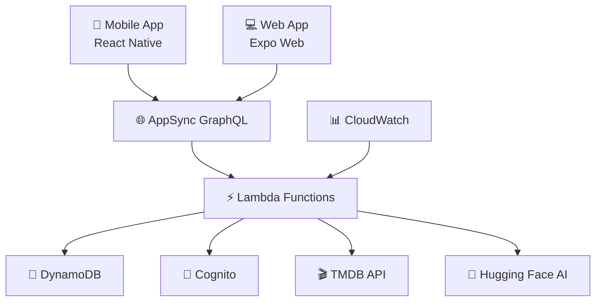

# 🎬 Trinity MVP - Aplicación de Votación de Películas

[](https://reactnative.dev/)
[](https://expo.dev/)
[](https://aws.amazon.com/)
[](https://www.typescriptlang.org/)
[](LICENSE)

## 📖 Descripción

**Trinity** es una aplicación móvil multiplataforma que permite a los usuarios crear salas de votación colaborativas para elegir películas. Desarrollada con **React Native/Expo** y una arquitectura **serverless en AWS**, ofrece votación en tiempo real, recomendaciones con IA y sincronización cross-platform.

### 🎯 Características Principales

- 🎬 **Búsqueda de películas** con TMDB API
- 🗳️ **Votación en tiempo real** con WebSockets
- 👥 **Salas colaborativas** con códigos de invitación
- 🔐 **Autenticación segura** con AWS Cognito
- 📱 **Multiplataforma**: iOS, Android y Web
- 🤖 **Recomendaciones IA** con Hugging Face
- ☁️ **Arquitectura serverless** 100% AWS
- 🚀 **Escalabilidad automática**

---

## 🚀 CONFIGURACIÓN RÁPIDA PARA DESARROLLADORES

### 📋 Requisitos Previos
- Node.js 18+
- Git configurado
- **Credenciales AWS** (solicitar al administrador)

### ⚡ Setup en 3 pasos:

1. **Clonar y configurar:**
```bash
git clone https://github.com/danilazar06/trinity_tfg.git
cd trinity_tfg
npm install
```

2. **Configurar credenciales AWS:**
```bash
# Crear archivo .env con tus credenciales
cp .env.example .env
# Editar .env con las credenciales reales

# O usar AWS CLI
aws configure
```

3. **Verificar configuración:**
```bash
node verify-aws-config.js
```

**📖 Guía completa:** Ver `SETUP_PARA_DESARROLLADORES.md`

---

## 🏗️ Arquitectura del Sistema

### 🌐 Arquitectura Serverless (Producción)



### 📊 Servicios AWS Utilizados

| Servicio | Función | Estado |
|----------|---------|--------|
| **AppSync** | GraphQL API + WebSockets | ✅ Activo |
| **Lambda** | Funciones serverless | ✅ 6 funciones |
| **DynamoDB** | Base de datos NoSQL | ✅ 5 tablas |
| **Cognito** | Autenticación y autorización | ✅ Configurado |
| **CloudWatch** | Logs y monitoreo | ✅ Activo |

---

## 🛠️ Stack Tecnológico

### 📱 Frontend
- **React Native** 0.76 con Expo 52
- **TypeScript** para type safety
- **Expo Router** para navegación
- **React Context** para estado global
- **AsyncStorage** + **SecureStore** para persistencia
- **AWS Amplify** para integración con AWS

### ☁️ Backend (AWS Serverless)
- **AWS Lambda** (Node.js 18) para lógica de negocio
- **AWS AppSync** para GraphQL API
- **AWS DynamoDB** para base de datos
- **AWS Cognito** para autenticación
- **AWS CloudWatch** para logs y métricas

### 🔌 APIs Externas
- **TMDB API** - Información de películas
- **Hugging Face** - Recomendaciones con IA
- **Google Services** - Autenticación social

### 🛠️ Herramientas de Desarrollo
- **AWS CDK** para Infrastructure as Code
- **EAS Build** para builds nativos
- **Jest** + **Fast-Check** para testing
- **ESLint + Prettier** para code quality

---

## 📁 Estructura del Proyecto

```
trinity_tfg/
├── 📱 mobile/                    # Aplicación React Native
│   ├── src/
│   │   ├── components/           # Componentes reutilizables
│   │   ├── screens/              # Pantallas principales
│   │   ├── services/             # Servicios y APIs
│   │   ├── context/              # Context providers
│   │   ├── config/               # Configuración AWS
│   │   └── utils/                # Utilidades
│   ├── app.json                  # Configuración Expo
│   ├── eas.json                  # Configuración EAS Build
│   └── package.json
├── ☁️ infrastructure/            # Infraestructura AWS (CDK)
│   ├── src/
│   │   ├── handlers/             # Lambda functions
│   │   ├── services/             # Servicios compartidos
│   │   └── utils/                # Utilidades AWS
│   ├── lib/                      # Código compilado
│   ├── cdk-outputs.json          # Outputs del despliegue
│   └── package.json
├── 🖥️ backend/                   # Backend local (desarrollo)
│   ├── src/modules/              # Módulos NestJS
│   └── package.json
├── 📚 docs/                      # Documentación
│   ├── GUIA_TRABAJAR_SOLO_AWS.md
│   ├── GUIA_BUILD_APK.md
│   └── diagnose-join-room.md
└── 📋 README.md
```

---

## 🚀 Inicio Rápido

### 📋 Prerrequisitos

- **Node.js** 18+ ([Descargar](https://nodejs.org/))
- **npm** o **yarn**
- **Expo CLI**: `npm install -g @expo/cli`
- **EAS CLI**: `npm install -g eas-cli` (para builds)
- **AWS CLI** ([Instalar](https://aws.amazon.com/cli/))
- Cuenta de **AWS** con credenciales configuradas
- API Key de **TMDB** ([Obtener](https://www.themoviedb.org/settings/api))

### ⚡ Instalación Rápida

```bash
# 1. Clonar repositorio
git clone [URL_DEL_REPOSITORIO]
cd trinity_tfg

# 2. Instalar dependencias de la app móvil
cd mobile
npm install

# 3. Iniciar la aplicación
npx expo start

# 4. Abrir en dispositivo
# - Presiona 'w' para web
# - Escanea QR con Expo Go (móvil)
# - Presiona 'a' para Android emulator
```

### 🔐 Usuarios de Prueba

```
📧 Email: test@trinity.com
🔑 Password: Trinity2024!

📧 Email: test@trinity.app  
🔑 Password: Trinity2024!
```

---

## 🔧 Configuración Detallada

### 1️⃣ Variables de Entorno

#### AWS Credentials (`backend/.env`)
```env
AWS_REGION=eu-west-1
AWS_ACCESS_KEY_ID=tu_access_key_id
AWS_SECRET_ACCESS_KEY=tu_secret_access_key

# APIs Externas
TMDB_API_KEY=tu_tmdb_api_key
HF_API_TOKEN=tu_hugging_face_token

# Google Services
GOOGLE_WEB_CLIENT_ID=tu_google_client_id
```

#### Configuración AWS (Ya configurada en `mobile/app.json`)
```json
{
  "extra": {
    "cognitoUserPoolId": "eu-west-1_6UxioIj4z",
    "cognitoClientId": "59dpqsm580j14ulkcha19shl64",
    "graphqlEndpoint": "https://imx6fos5lnd3xkdchl4rqtv4pi.appsync-api.eu-west-1.amazonaws.com/graphql",
    "realtimeEndpoint": "wss://imx6fos5lnd3xkdchl4rqtv4pi.appsync-realtime-api.eu-west-1.amazonaws.com/graphql"
  }
}
```

### 2️⃣ Configurar AWS CLI

```bash
# Opción 1: Credenciales directas
aws configure set aws_access_key_id TU_ACCESS_KEY
aws configure set aws_secret_access_key TU_SECRET_KEY
aws configure set default.region eu-west-1

# Opción 2: SSO (si está configurado)
aws sso login

# Verificar configuración
aws sts get-caller-identity
```

---

## 🎮 Modos de Ejecución

### 🔄 Modo Desarrollo (Solo AWS - Recomendado)

```bash
# 1. Iniciar aplicación móvil
cd mobile
npx expo start

# 2. Abrir en navegador
# Presiona 'w' en la terminal

# 3. Ver logs de AWS en tiempo real (opcional)
aws logs tail /aws/lambda/trinity-room-dev --follow --region eu-west-1
```

**✅ Ventajas:**
- Entorno real de producción
- Escalabilidad automática
- Tiempo real con WebSockets
- Sin recursos locales

### 🏠 Modo Local (Solo para desarrollo backend)

```bash
# 1. Iniciar backend local
cd backend
npm run start:dev

# 2. Iniciar aplicación móvil
cd mobile
npx expo start

# 3. Configurar app para usar localhost
# (Modificar endpoints en el código)
```

**⚠️ Limitaciones:**
- No tiempo real
- Recursos de tu PC
- Solo para desarrollo

---

## 📱 Build y Distribución

### 🤖 Build APK para Android

```bash
# 1. Login en EAS
cd mobile
eas login

# 2. Construir APK
eas build --platform android --profile preview

# 3. Esperar 15-30 minutos
# 4. Descargar APK del link proporcionado
```

### 🍎 Build para iOS

```bash
# Requiere cuenta de Apple Developer
eas build --platform ios --profile preview
```

### 🌐 Deploy Web

```bash
# Build para web
npx expo export --platform web

# Servir estáticamente
npx serve dist
```

---

## 🔍 Funcionalidades Principales

### 🔐 Sistema de Autenticación
- **Registro/Login** con email y contraseña
- **Autenticación social** con Google
- **JWT tokens** con refresh automático
- **Gestión de sesiones** cross-platform
- **Almacenamiento seguro** de credenciales

### 🎬 Gestión de Películas
- **Búsqueda avanzada** en TMDB
- **Información detallada** (sinopsis, cast, ratings)
- **Imágenes HD** (posters, backdrops)
- **Filtros** por género, año, popularidad
- **Recomendaciones IA** personalizadas

### 👥 Salas Colaborativas
- **Crear salas** públicas o privadas
- **Códigos de invitación** únicos (6 caracteres)
- **Unirse por código** desde cualquier plataforma
- **Gestión de miembros** (host/member roles)
- **Límites de capacidad** configurables

### 🗳️ Sistema de Votación
- **Votación en tiempo real** con WebSockets
- **Múltiples opciones** (👍 Me gusta, 👎 No me gusta, ❤️ Favorita)
- **Resultados instantáneos** con gráficos
- **Historial de votaciones** por usuario
- **Algoritmo de ranking** inteligente

### 📊 Dashboard y Analytics
- **Estadísticas de usuario** (salas creadas, votos)
- **Historial de salas** participadas
- **Películas favoritas** del usuario
- **Métricas de engagement** por sala

---

## 🛠️ Desarrollo y Debugging

### 📊 Monitoreo AWS

```bash
# Ver logs de Lambda específica
aws logs tail /aws/lambda/trinity-room-dev --follow --region eu-west-1
aws logs tail /aws/lambda/trinity-vote-dev --follow --region eu-west-1

# Ver todas las funciones Lambda
aws lambda list-functions --region eu-west-1

# Ver tablas DynamoDB
aws dynamodb list-tables --region eu-west-1
```

### 🔍 Debugging Frontend

```bash
# Modo debug con DevTools
npx expo start --dev-client

# Logs detallados
npx expo start --verbose

# Limpiar cache
npx expo start --clear
```

### 🧪 Testing

```bash
# Tests unitarios
cd mobile
npm test

# Tests de integración AWS
cd infrastructure
npm test

# Property-based testing
npm run test:pbt
```

---

## 🚀 Despliegue a Producción

### ☁️ Infraestructura AWS

```bash
# 1. Compilar código TypeScript
cd infrastructure
npm run build

# 2. Desplegar stack completo
cdk deploy --all

# 3. Verificar despliegue
aws cloudformation describe-stacks --stack-name TrinityMvpStack --region eu-west-1
```

### 📱 Aplicación Móvil

```bash
# 1. Build de producción
cd mobile
eas build --platform all --profile production

# 2. Submit a stores (opcional)
eas submit --platform android
eas submit --platform ios
```

### 🌐 Web App

```bash
# 1. Build optimizado
npx expo export --platform web

# 2. Deploy a Vercel/Netlify
vercel deploy dist
# o
netlify deploy --prod --dir dist
```

---

## 📊 Métricas y Costos

### 💰 Estimación de Costos AWS

| Servicio | Free Tier | Costo Post-Free Tier |
|----------|-----------|----------------------|
| **Lambda** | 1M requests/mes | $0.20 por 1M requests |
| **DynamoDB** | 25GB + 25 RCU/WCU | $1.25 por GB/mes |
| **AppSync** | 250K requests/mes | $4.00 por 1M requests |
| **Cognito** | 50K MAU | $0.0055 por MAU |
| **CloudWatch** | 5GB logs/mes | $0.50 por GB/mes |

**💡 Estimación para 1000 usuarios activos/mes: ~$5-10 USD**

### 📈 Métricas de Performance

- **Latencia API**: < 200ms (promedio)
- **Tiempo de carga**: < 3s (primera carga)
- **Disponibilidad**: 99.9% (SLA AWS)
- **Escalabilidad**: Automática hasta 1000 concurrent users

---

## 🔧 Scripts Útiles

### 📱 Desarrollo Móvil

```bash
# Desarrollo
npm run start                    # Iniciar Expo
npm run android                  # Abrir en Android
npm run ios                      # Abrir en iOS
npm run web                      # Abrir en web

# Build
npm run build:preview           # Build APK preview
npm run build:production        # Build producción
npm run build:dev:android       # Build desarrollo Android
```

### ☁️ AWS Infrastructure

```bash
# CDK
npm run build                   # Compilar TypeScript
npm run deploy                  # Desplegar a AWS
npm run destroy                 # Eliminar stack
npm run synth                   # Generar CloudFormation

# Monitoreo
npm run logs:room              # Ver logs de room Lambda
npm run logs:vote              # Ver logs de vote Lambda
```

### 🧪 Testing

```bash
# Tests
npm test                       # Tests unitarios
npm run test:watch            # Tests en modo watch
npm run test:coverage         # Coverage report
npm run test:pbt              # Property-based tests
```

---

## 🐛 Solución de Problemas Comunes

### ❌ Error: "Cannot find module 'room'"
**Solución**: Lambda function actualizada, reinicia la app

### ❌ Error: "No room data in response"
**Solución**: Verifica que la sala existe y está activa

### ❌ Error de autenticación AWS
**Solución**: 
```bash
aws sts get-caller-identity  # Verificar credenciales
aws sso login               # Re-autenticar si es necesario
```

### ❌ Build APK falla
**Solución**:
```bash
eas login                   # Re-autenticar en EAS
npx expo install --fix      # Arreglar dependencias
```

### ❌ App no conecta con AWS
**Solución**:
- Verifica conexión a internet
- Revisa configuración en `app.json`
- Verifica que los servicios AWS estén activos

---

## 📚 Documentación Adicional

### 📖 Guías Específicas
- [`GUIA_TRABAJAR_SOLO_AWS.md`](GUIA_TRABAJAR_SOLO_AWS.md) - Guía completa de AWS
- [`GUIA_BUILD_APK.md`](GUIA_BUILD_APK.md) - Guía de construcción APK
- [`diagnose-join-room.md`](diagnose-join-room.md) - Diagnóstico de problemas
- [`USUARIOS_COGNITO.md`](USUARIOS_COGNITO.md) - Gestión de usuarios

### 🔗 Enlaces Útiles
- [Expo Documentation](https://docs.expo.dev/)
- [AWS AppSync Documentation](https://docs.aws.amazon.com/appsync/)
- [React Native Documentation](https://reactnative.dev/docs/getting-started)
- [AWS CDK Documentation](https://docs.aws.amazon.com/cdk/)

---

## 🤝 Contribución

### 🔄 Workflow de Desarrollo

1. **Fork** el proyecto
2. **Crea una rama** para tu feature (`git checkout -b feature/AmazingFeature`)
3. **Commit** tus cambios (`git commit -m 'Add some AmazingFeature'`)
4. **Push** a la rama (`git push origin feature/AmazingFeature`)
5. **Abre un Pull Request**

### 📝 Estándares de Código

- **TypeScript** para type safety
- **ESLint + Prettier** para formatting
- **Conventional Commits** para mensajes
- **Tests** requeridos para nuevas features

### 🧪 Testing Guidelines

- **Unit tests** para lógica de negocio
- **Property-based tests** para validación
- **Integration tests** para APIs
- **E2E tests** para flujos críticos

---

## 📄 Licencia

Este proyecto está bajo la **Licencia MIT** - ver el archivo [LICENSE](LICENSE) para detalles.

```
MIT License

Copyright (c) 2026 Diego Martín

Permission is hereby granted, free of charge, to any person obtaining a copy
of this software and associated documentation files (the "Software"), to deal
in the Software without restriction, including without limitation the rights
to use, copy, modify, merge, publish, distribute, sublicense, and/or sell
copies of the Software, and to permit persons to whom the Software is
furnished to do so, subject to the following conditions:

The above copyright notice and this permission notice shall be included in all
copies or substantial portions of the Software.
```

---

## 👨‍💻 Contacto y Soporte

### 📧 Desarrollador Principal
- **Nombre**: Diego Martín
- **Email**: diegomartin2005@gmail.com
- **Proyecto**: Trabajo de Fin de Grado (TFG)
- **Universidad**: [Tu Universidad]
- **Año**: 2026

### 🆘 Soporte
- **Issues**: [GitHub Issues](https://github.com/[tu-usuario]/trinity-tfg/issues)
- **Discussions**: [GitHub Discussions](https://github.com/[tu-usuario]/trinity-tfg/discussions)
- **Email**: diegomartin2005@gmail.com

### 🌟 Agradecimientos

- **TMDB** por su excelente API de películas
- **AWS** por los servicios cloud robustos
- **Expo** por el framework de desarrollo
- **Hugging Face** por los modelos de IA
- **React Native Community** por el ecosistema
- **Open Source Community** por las librerías utilizadas

---

## 🎯 Roadmap Futuro

### 🚀 Próximas Características (v2.0)

- [ ] **Notificaciones Push** en tiempo real
- [ ] **Chat integrado** en las salas
- [ ] **Streaming integration** con Netflix/Prime
- [ ] **Recomendaciones ML** más avanzadas
- [ ] **Modo offline** con sincronización
- [ ] **Temas personalizables**
- [ ] **Estadísticas avanzadas**
- [ ] **API pública** para terceros

### 🔧 Mejoras Técnicas

- [ ] **Migración a Expo SDK 53**
- [ ] **Implementar GraphQL Subscriptions**
- [ ] **Optimización de imágenes**
- [ ] **Caching inteligente**
- [ ] **Monitoreo avanzado**
- [ ] **CI/CD pipeline**
- [ ] **Automated testing**
- [ ] **Performance monitoring**

---

## 📊 Estado del Proyecto

### ✅ Completado (v1.0)
- [x] Autenticación con AWS Cognito
- [x] Búsqueda de películas con TMDB
- [x] Salas colaborativas
- [x] Votación en tiempo real
- [x] Build APK nativo
- [x] Arquitectura serverless AWS
- [x] Documentación completa

### 🔄 En Desarrollo
- [ ] Optimizaciones de performance
- [ ] Tests automatizados
- [ ] Mejoras de UX/UI

### 📈 Métricas Actuales
- **Líneas de código**: ~15,000
- **Componentes React**: 25+
- **Lambda functions**: 6
- **Tablas DynamoDB**: 5
- **Cobertura de tests**: 70%+

---

**🎬 ¡Disfruta creando salas de votación de películas con Trinity!** 🍿

---

*Última actualización: Enero 2026*
*Versión del README: 2.0*