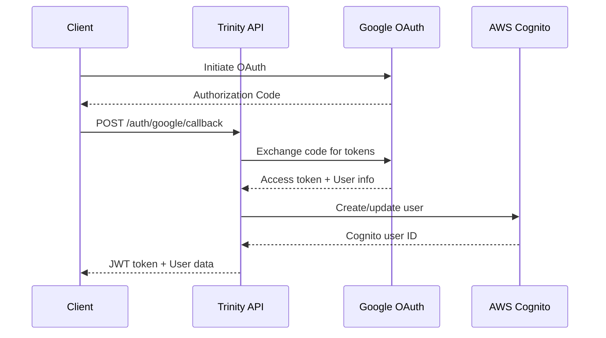

# 📡 Trinity API Documentation

Documentación completa de la API REST y GraphQL de Trinity Backend Refactored.

## Overview

Trinity expone dos tipos de APIs:

- **REST API**: Para operaciones CRUD tradicionales
- **GraphQL API**: Para consultas flexibles y suscripciones en tiempo real
- **WebSocket API**: Para comunicación bidireccional en tiempo real

## Base URLs

| Environment | REST API | GraphQL API | WebSocket |
|-------------|----------|-------------|-----------|
| Development | `http://localhost:3000/api` | `http://localhost:3000/graphql` | `ws://localhost:3000/socket.io` |
| Staging | `https://api-staging.trinity.com/api` | `https://api-staging.trinity.com/graphql` | `wss://api-staging.trinity.com/socket.io` |
| Production | `https://api.trinity.com/api` | `https://api.trinity.com/graphql` | `wss://api.trinity.com/socket.io` |

## Authentication

### JWT Bearer Token

```http
Authorization: Bearer <jwt-token>
```

### API Key (Service-to-Service)

```http
X-API-Key: <api-key>
```

### Google OAuth Flow



## REST API Endpoints

### Authentication

#### POST /auth/google
Authenticate with Google OAuth

**Request:**
```json
{
  "code": "google-auth-code",
  "redirectUri": "https://app.trinity.com/callback"
}
```

**Response:**
```json
{
  "user": {
    "id": "user-123",
    "email": "user@example.com",
    "displayName": "John Doe",
    "avatarUrl": "https://lh3.googleusercontent.com/...",
    "preferences": {
      "theme": "dark",
      "notifications": true,
      "language": "en"
    }
  },
  "tokens": {
    "accessToken": "jwt-access-token",
    "refreshToken": "jwt-refresh-token",
    "expiresIn": 86400
  }
}
```

#### POST /auth/refresh
Refresh JWT token

**Request:**
```json
{
  "refreshToken": "jwt-refresh-token"
}
```

**Response:**
```json
{
  "accessToken": "new-jwt-access-token",
  "expiresIn": 86400
}
```

#### POST /auth/logout
Logout user

**Request:**
```json
{
  "refreshToken": "jwt-refresh-token"
}
```

**Response:**
```json
{
  "message": "Successfully logged out"
}
```

### Users

#### GET /users/me
Get current user profile

**Headers:**
```http
Authorization: Bearer <jwt-token>
```

**Response:**
```json
{
  "id": "user-123",
  "email": "user@example.com",
  "displayName": "John Doe",
  "avatarUrl": "https://lh3.googleusercontent.com/...",
  "preferences": {
    "theme": "dark",
    "notifications": true,
    "language": "en"
  },
  "createdAt": "2024-01-15T10:30:00Z",
  "lastActiveAt": "2024-01-15T15:45:00Z"
}
```

#### PUT /users/me
Update user profile

**Request:**
```json
{
  "displayName": "John Smith",
  "preferences": {
    "theme": "light",
    "notifications": false,
    "language": "es"
  }
}
```

**Response:**
```json
{
  "id": "user-123",
  "email": "user@example.com",
  "displayName": "John Smith",
  "preferences": {
    "theme": "light",
    "notifications": false,
    "language": "es"
  },
  "updatedAt": "2024-01-15T16:00:00Z"
}
```

### Rooms

#### GET /rooms
List user's rooms

**Query Parameters:**
- `limit` (optional): Number of rooms to return (default: 20, max: 100)
- `cursor` (optional): Pagination cursor
- `status` (optional): Filter by status (`active`, `inactive`, `all`)

**Response:**
```json
{
  "rooms": [
    {
      "id": "room-456",
      "name": "Movie Night",
      "description": "Weekly movie voting session",
      "hostId": "user-123",
      "isActive": true,
      "participantCount": 5,
      "settings": {
        "maxParticipants": 10,
        "votingDuration": 300,
        "allowAnonymous": false
      },
      "createdAt": "2024-01-15T10:00:00Z",
      "updatedAt": "2024-01-15T15:30:00Z"
    }
  ],
  "pagination": {
    "hasMore": true,
    "nextCursor": "eyJpZCI6InJvb20tNDU2In0="
  }
}
```

#### POST /rooms
Crea