# Trinity System Architecture

## Overview

Trinity Backend Refactored follows a clean, hexagonal architecture pattern with clear separation of concerns, enabling maintainability, testability, and scalability.

## High-Level Architecture

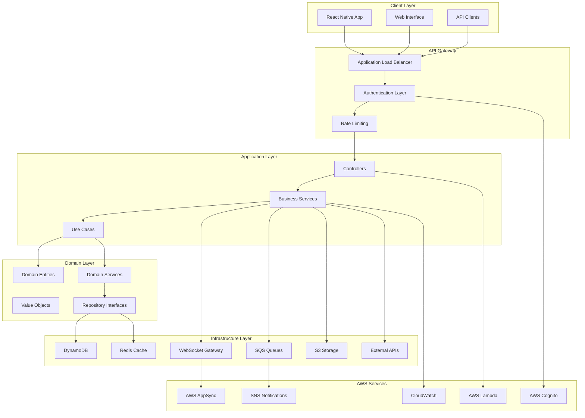

## Clean Architecture Layers

### 1. Domain Layer (Core Business Logic)

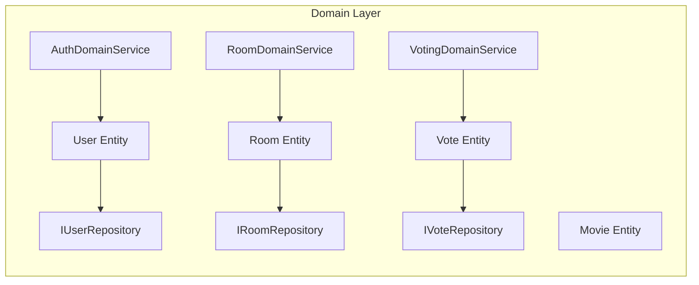

**Responsibilities:**
- Core business entities and value objects
- Business rules and domain logic
- Repository interfaces (ports)
- Domain services for complex business operations

### 2. Application Layer (Use Cases)

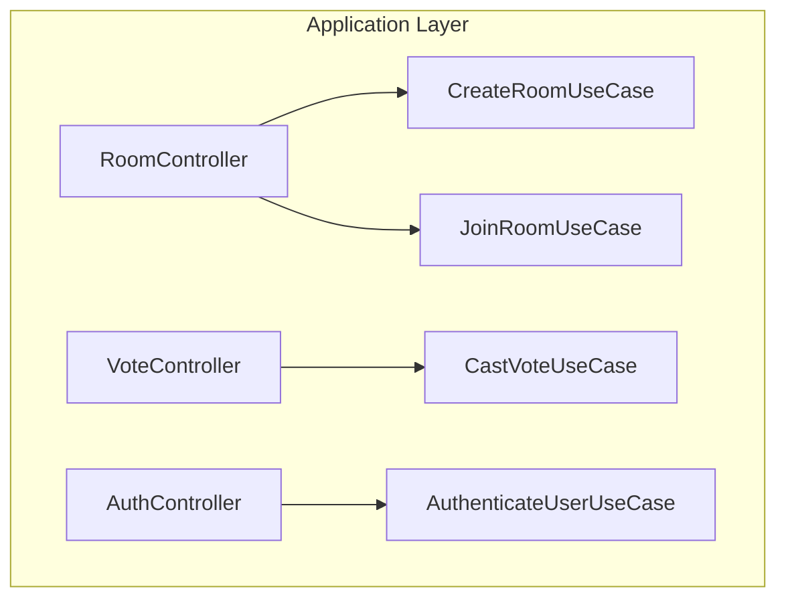

**Responsibilities:**
- Application-specific business rules
- Orchestrates domain objects
- Defines use cases and workflows
- Handles application services

### 3. Infrastructure Layer (External Concerns)

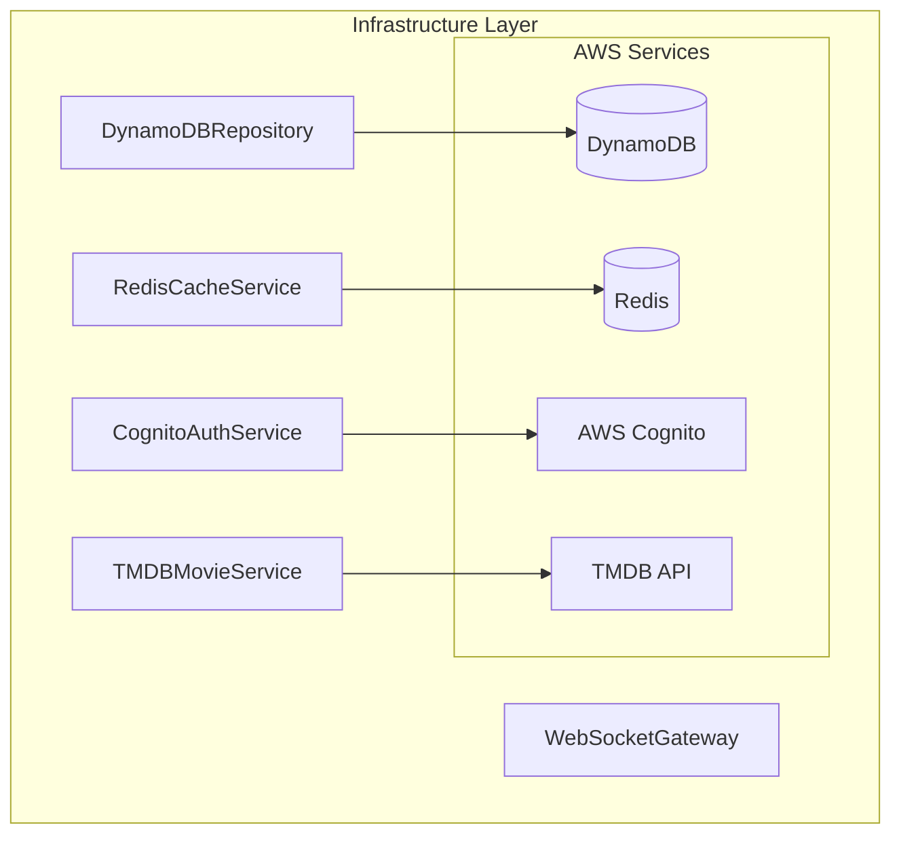

**Responsibilities:**
- Database implementations
- External service integrations
- Infrastructure concerns
- Framework-specific code

## Data Flow Architecture

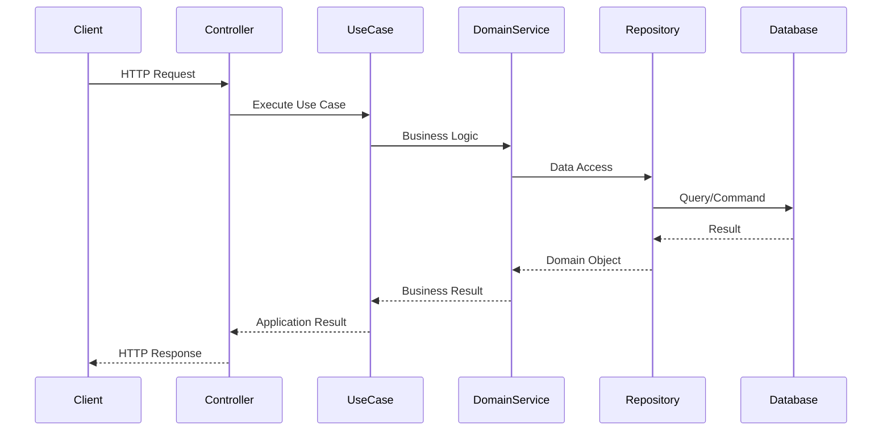

## Real-time Communication Architecture

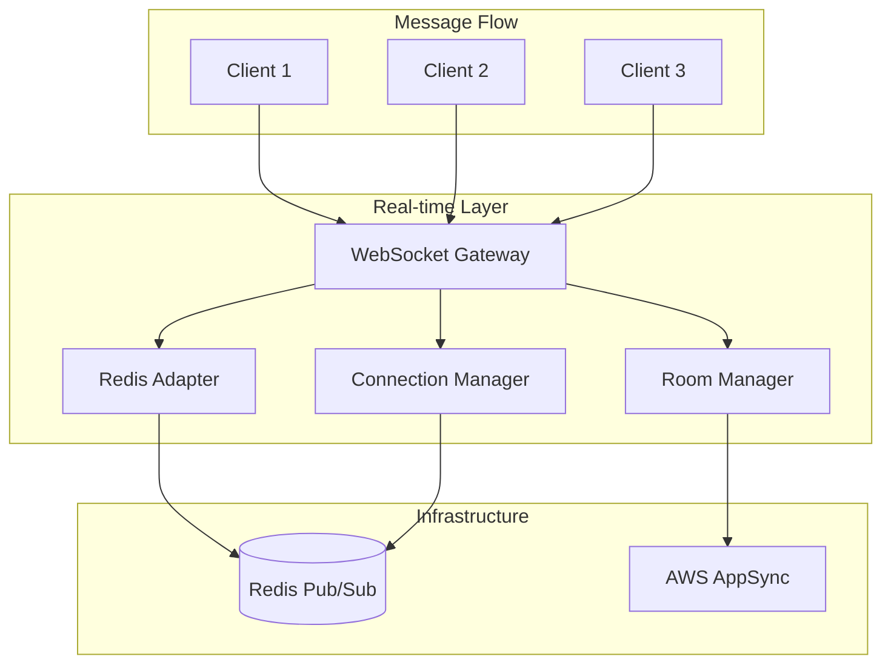

## Migration System Architecture

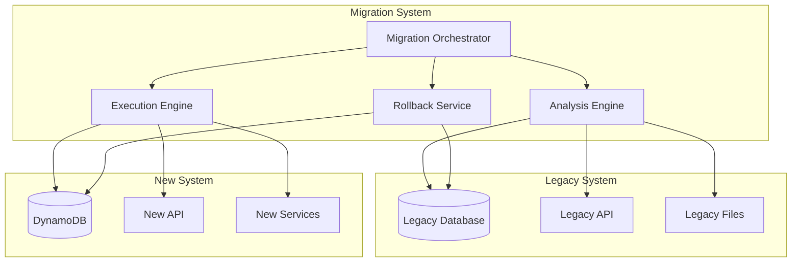

## Quality Assurance Architecture

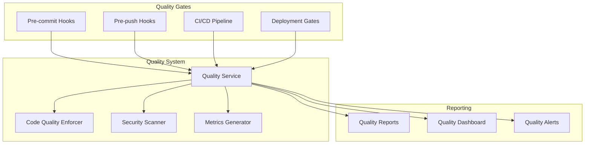

## Deployment Architecture

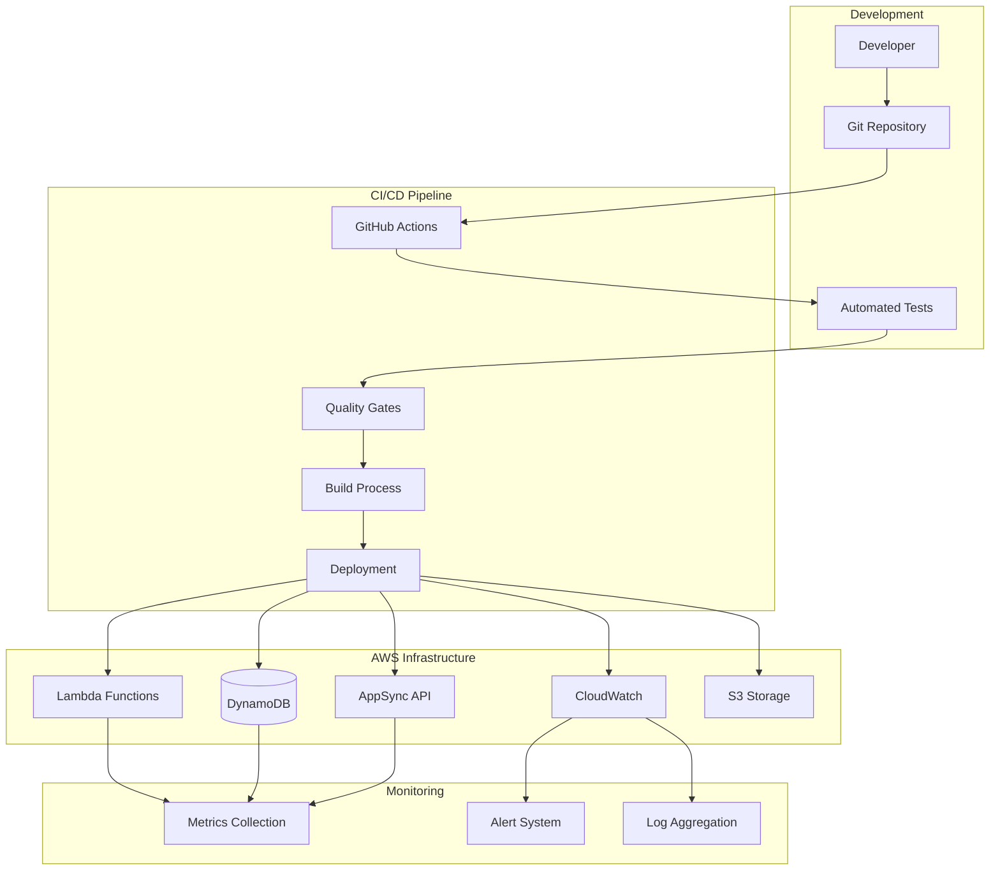

## Security Architecture

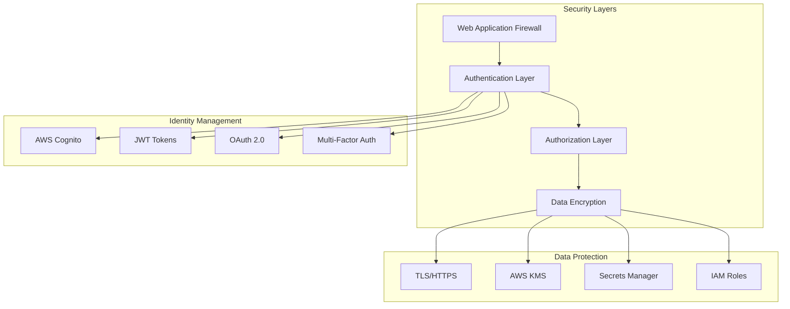

## Performance Architecture

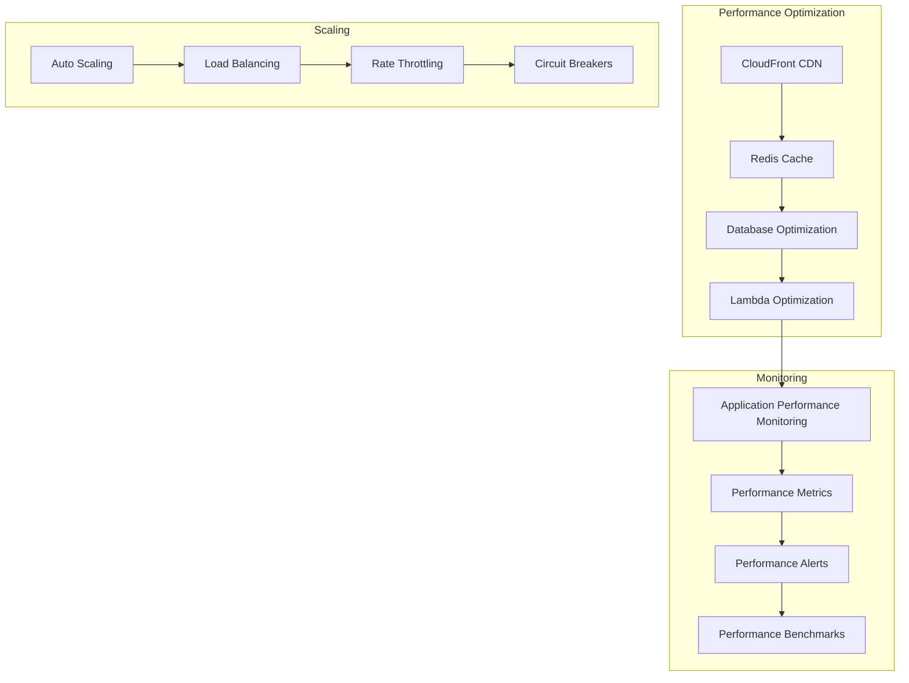

## Key Architectural Decisions

### 1. Clean Architecture
- **Decision**: Implement hexagonal architecture
- **Rationale**: Separation of concerns, testability, maintainability
- **Trade-offs**: Initial complexity vs long-term benefits

### 2. Serverless-First
- **Decision**: Use AWS Lambda for compute
- **Rationale**: Cost efficiency, automatic scaling, reduced operations
- **Trade-offs**: Cold starts vs operational simplicity

### 3. Event-Driven Architecture
- **Decision**: Use events for real-time communication
- **Rationale**: Scalability, loose coupling, real-time requirements
- **Trade-offs**: Complexity vs performance

### 4. NoSQL Database
- **Decision**: Use DynamoDB as primary database
- **Rationale**: Serverless compatibility, performance, AWS integration
- **Trade-offs**: Query flexibility vs performance and cost

### 5. GraphQL + REST Hybrid
- **Decision**: Support both GraphQL (mobile) and REST (web)
- **Rationale**: Mobile app compatibility, flexibility
- **Trade-offs**: Maintenance overhead vs compatibility

## Quality Attributes

### Scalability
- Horizontal scaling through serverless architecture
- Auto-scaling based on demand
- Stateless design for easy scaling

### Performance
- Sub-100ms API response times
- Real-time WebSocket communication
- Efficient caching strategies

### Security
- Zero-trust security model
- End-to-end encryption
- Comprehensive audit logging

### Reliability
- 99.9% uptime target
- Automated failover mechanisms
- Comprehensive monitoring and alerting

### Maintainability
- Clean architecture principles
- Comprehensive test coverage (>80%)
- Automated quality gates

### Observability
- Distributed tracing
- Comprehensive logging
- Real-time metrics and dashboards