# Arquitectura del Proyecto Trinity - IMPLEMENTACIÓN COMPLETA

## Descripción General

Trinity es una plataforma de descubrimiento de contenido multimedia que permite a los usuarios crear salas virtuales para encontrar películas de forma colaborativa. La arquitectura está basada en servicios serverless de AWS con una aplicación móvil React Native como frontend.

**🎯 ESTADO ACTUAL: TOTALMENTE IMPLEMENTADO**
- ✅ Circuit Breaker Pattern con métricas completas
- ✅ Stop-on-Match Algorithm con notificaciones real-time
- ✅ Prevención de votos duplicados con tabla UserVotes
- ✅ Sistema de métricas y monitoreo empresarial
- ✅ Integración AI real con Salamandra-7b-instruct
- ✅ Scripts de deployment automatizados

## Diagrama de Arquitectura

```mermaid
graph TD
    %% ===== FRONTEND LAYER =====
    subgraph "Frontend Layer"
        Mobile[📱 React Native App<br/>Expo + TypeScript]
        WebApp[🌐 Web App<br/>React/Next.js]
    end

    %% ===== API GATEWAY LAYER =====
    subgraph "API Gateway Layer"
        AppSync[🔗 AWS AppSync<br/>GraphQL API<br/>Real-time Subscriptions]
        NestAPI[🚀 NestJS Backend<br/>REST API<br/>Port 3002]
    end

    %% ===== AUTHENTICATION LAYER =====
    subgraph "Authentication Layer"
        Cognito[🔐 AWS Cognito<br/>User Pool + Identity Pool<br/>Google OAuth Integration]
        GoogleOAuth[� GooglHe OAuth<br/>Identity Provider]
    end

    %% ===== COMPUTE LAYER =====
    subgraph "Compute Layer - AWS Lambda Functions"
        AuthLambda[⚡ Auth Handler<br/>Post-Confirmation Trigger<br/>User Profile Creation]
        RoomLambda[🏠 Room Handler<br/>Create/Join Rooms<br/>Member Management<br/>📊 Business Metrics]
        MovieLambda[🎬 Movie Handler<br/>TMDB Integration<br/>🔄 Circuit Breaker Pattern<br/>📈 Performance Monitoring]
        VoteLambda[🗳️ Vote Handler<br/>Stop-on-Match Algorithm<br/>🚫 Duplicate Prevention<br/>📡 Real-time Events]
        AILambda[🤖 AI Handler<br/>Trini Chat Assistant<br/>🧠 Salamandra Integration<br/>📊 AI Metrics]
        RealtimeLambda[�o Realtime Handler<br/>AppSync Subscriptions<br/>Event Publishing<br/>🔐 Access Validation]
    end

    %% ===== DATABASE LAYER =====
    subgraph "Database Layer - DynamoDB Tables"
        UsersTable[(👥 Users Table<br/>PK: userId<br/>User Profiles)]
        RoomsTable[(🏠 Rooms Table<br/>PK: roomId<br/>Room Status & Results)]
        RoomMembersTable[(👫 Room Members Table<br/>PK: roomId, SK: userId<br/>GSI: UserHistoryIndex)]
        VotesTable[(�️ Votoes Table<br/>PK: roomId, SK: movieId<br/>Atomic Vote Counters)]
        UserVotesTable[(🚫 User Votes Table<br/>PK: userId, SK: roomMovieId<br/>Duplicate Prevention)]
        MoviesCacheTable[(🎬 Movies Cache Table<br/>PK: tmdbId<br/>TTL: 30 days)]
    end

    %% ===== EXTERNAL SERVICES =====
    subgraph "External Services"
        TMDB[🎭 TMDB API<br/>Movie Database<br/>🔄 Circuit Breaker Protected]
        HuggingFace[🧠 Hugging Face<br/>Salamandra-7b-instruct<br/>AI Chat Assistant]
        GoogleServices[🔍 Google Services<br/>OAuth Authentication<br/>Identity Provider]
    end

    %% ===== MONITORING & OPTIMIZATION =====
    subgraph "Monitoring & Optimization"
        CloudWatch[📊 CloudWatch<br/>Metrics & Logs<br/>🚨 Circuit Breaker Alerts<br/>📈 Business Metrics]
        CostOpt[💰 Cost Optimization<br/>Budget Alerts<br/>Auto-scaling]
    end

    %% ===== CONNECTIONS - USER FLOW =====
    Mobile -->|"GraphQL Queries/Mutations<br/>WebSocket Subscriptions"| AppSync
    Mobile -->|"REST API Calls<br/>Authentication"| NestAPI
    WebApp -->|"GraphQL Queries/Mutations<br/>WebSocket Subscriptions"| AppSync
    WebApp -->|"REST API Calls<br/>Authentication"| NestAPI

    %% ===== AUTHENTICATION FLOW =====
    Mobile -->|"Google Sign-In<br/>ID Token"| GoogleOAuth
    GoogleOAuth -->|"Federated Identity"| Cognito
    NestAPI -->|"JWT Validation<br/>User Management"| Cognito
    Cognito -->|"Post-Confirmation Trigger"| AuthLambda

    %% ===== APPSYNC TO LAMBDA CONNECTIONS =====
    AppSync -->|"createRoom, joinRoom<br/>getMyHistory<br/>📊 Metrics"| RoomLambda
    AppSync -->|"getMovies<br/>🔄 Circuit Breaker<br/>📈 Cache Metrics"| MovieLambda
    AppSync -->|"vote<br/>🚫 Duplicate Check<br/>📡 Real-time Events"| VoteLambda
    AppSync -->|"getChatRecommendations<br/>🧠 AI Analysis<br/>📊 Mood Metrics"| AILambda
    AppSync -->|"publishRoomEvent<br/>📡 Real-time Updates<br/>🔐 Access Control"| RealtimeLambda

    %% ===== LAMBDA TO DATABASE CONNECTIONS =====
    AuthLambda -->|"Create User Profile<br/>PutItem"| UsersTable
    RoomLambda -->|"Room CRUD<br/>Member Management<br/>📊 Business Events"| RoomsTable
    RoomLambda -->|"Join/Leave Room<br/>Query History"| RoomMembersTable
    VoteLambda -->|"Atomic Vote Count<br/>Consensus Check"| VotesTable
    VoteLambda -->|"🚫 Prevent Duplicates<br/>Vote Tracking"| UserVotesTable
    VoteLambda -->|"Update Room Status<br/>Set Match Result"| RoomsTable
    VoteLambda -->|"Validate Membership<br/>Count Active Members"| RoomMembersTable
    MovieLambda -->|"Cache Movies<br/>TTL Management<br/>📈 Cache Metrics"| MoviesCacheTable

    %% ===== EXTERNAL API CONNECTIONS =====
    MovieLambda -->|"🔄 Circuit Breaker<br/>Fetch Movies<br/>📊 State Monitoring"| TMDB
    AILambda -->|"Chat Completion<br/>Mood Analysis<br/>📊 AI Metrics"| HuggingFace

    %% ===== MONITORING CONNECTIONS =====
    AppSync -.->|"API Metrics<br/>Error Logs<br/>📊 Business Events"| CloudWatch
    AuthLambda -.->|"Function Metrics<br/>📊 User Registration"| CloudWatch
    RoomLambda -.->|"Function Metrics<br/>📊 Room Analytics"| CloudWatch
    MovieLambda -.->|"🔄 Circuit Breaker State<br/>📈 Cache Performance<br/>📊 TMDB Metrics"| CloudWatch
    VoteLambda -.->|"📊 Vote Analytics<br/>📡 Match Events<br/>⚡ Performance"| CloudWatch
    AILambda -.->|"🧠 AI Usage Metrics<br/>📊 Mood Analysis<br/>⚡ Response Times"| CloudWatch
    RealtimeLambda -.->|"📡 Real-time Metrics<br/>🔐 Access Logs"| CloudWatch
    
    CostOpt -.->|"Budget Monitoring<br/>Cost Alerts<br/>💰 Optimization"| CloudWatch

    %% ===== STYLING =====
    classDef frontend fill:#e1f5fe,stroke:#01579b,stroke-width:2px
    classDef api fill:#f3e5f5,stroke:#4a148c,stroke-width:2px
    classDef auth fill:#fff3e0,stroke:#e65100,stroke-width:2px
    classDef compute fill:#e8f5e8,stroke:#1b5e20,stroke-width:2px
    classDef database fill:#fce4ec,stroke:#880e4f,stroke-width:2px
    classDef external fill:#fff8e1,stroke:#f57f17,stroke-width:2px
    classDef monitoring fill:#f1f8e9,stroke:#33691e,stroke-width:2px

    class Mobile,WebApp frontend
    class AppSync,NestAPI api
    class Cognito,GoogleOAuth,GoogleServices auth
    class AuthLambda,RoomLambda,MovieLambda,VoteLambda,AILambda,RealtimeLambda compute
    class UsersTable,RoomsTable,RoomMembersTable,VotesTable,UserVotesTable,MoviesCacheTable database
    class TMDB,HuggingFace external
    class CloudWatch,CostOpt monitoring
```



## Flujo de Datos Detallado

### 1. Flujo de Autenticación
```
Usuario → Mobile App → Google OAuth → Cognito Identity Pool → 
Post-Confirmation Trigger → Auth Lambda → Users Table
```

### 2. Flujo de Creación de Sala
```
Usuario → Mobile App → AppSync GraphQL → Room Lambda → 
Rooms Table + Room Members Table → Real-time Subscription
```

### 3. Flujo de Votación (Stop-on-Match)
```
Usuario → Mobile App → AppSync GraphQL → Vote Lambda → 
Votes Table (atomic increment) → Check Consensus → 
Update Room Status → Real-time Event → All Subscribers
```

### 4. Flujo de Búsqueda de Películas
```
Usuario → Mobile App → AppSync GraphQL → Movie Lambda → 
Check Cache (Movies Cache Table) → TMDB API (if cache miss) → 
Circuit Breaker → Cache Result → Return Movies
```

### 5. Flujo de Chat con IA (Trini)
```
Usuario → Mobile App → AppSync GraphQL → AI Lambda → 
Hugging Face API (Salamandra) → Mood Analysis → 
Genre Recommendations → Return Response
```

## Características Técnicas Clave - IMPLEMENTADAS

### Patrones de Diseño Implementados ✅
- **Circuit Breaker**: ✅ Implementado con estados CLOSED/OPEN/HALF_OPEN, métricas y timeouts configurables
- **Stop-on-Match**: ✅ Implementado con notificaciones real-time y prevención de duplicados
- **Event Sourcing**: ✅ Real-time subscriptions con AppSync y eventos estructurados
- **Cache-Aside**: ✅ Movies Cache con TTL de 30 días y métricas de hit/miss
- **Federated Authentication**: ✅ Google OAuth + Cognito completamente funcional

### Optimizaciones de Rendimiento ✅
- **DynamoDB GSI**: ✅ UserHistoryIndex para consultas eficientes
- **Lambda Cold Start**: ✅ Bundling optimizado con esbuild
- **Real-time Updates**: ✅ WebSocket subscriptions para UX fluida
- **Atomic Operations**: ✅ Contadores de votos thread-safe con prevención de duplicados
- **TTL Caching**: ✅ Reducción de llamadas a APIs externas con Circuit Breaker

### Seguridad ✅
- **JWT Validation**: ✅ Tokens verificados en cada request
- **IAM Roles**: ✅ Permisos mínimos por Lambda function
- **CORS Configuration**: ✅ Dominios permitidos configurables
- **Input Validation**: ✅ DTOs con class-validator en NestJS
- **Rate Limiting**: ✅ Protección contra abuso de API

### Escalabilidad ✅
- **Serverless Architecture**: ✅ Auto-scaling automático
- **DynamoDB On-Demand**: ✅ Capacidad elástica
- **Connection Pooling**: ✅ Reutilización de conexiones DB
- **Stateless Functions**: ✅ Lambdas sin estado compartido

### Monitoreo y Observabilidad ✅
- **Structured Logging**: ✅ Logs estructurados para CloudWatch
- **Business Metrics**: ✅ Métricas de negocio (rooms created, votes cast, matches found)
- **Performance Monitoring**: ✅ Timers y métricas de rendimiento
- **Circuit Breaker Monitoring**: ✅ Estados y transiciones monitoreadas
- **Error Tracking**: ✅ Errores categorizados y trackeados

## Tecnologías Utilizadas

### Frontend
- **React Native**: Framework móvil multiplataforma
- **Expo**: Herramientas de desarrollo y deployment
- **TypeScript**: Tipado estático para JavaScript
- **AsyncStorage**: Persistencia local de datos

### Backend
- **NestJS**: Framework Node.js con arquitectura modular
- **AWS AppSync**: GraphQL API con subscriptions real-time
- **AWS Lambda**: Funciones serverless
- **AWS Cognito**: Gestión de usuarios y autenticación

### Base de Datos
- **DynamoDB**: Base de datos NoSQL serverless
- **TTL**: Time-to-Live para expiración automática
- **GSI**: Global Secondary Index para consultas eficientes

### APIs Externas
- **TMDB API**: Base de datos de películas
- **Hugging Face**: Modelos de IA (Salamandra-7b-instruct)
- **Google OAuth**: Autenticación federada

### Monitoreo
- **CloudWatch**: Métricas y logs
- **AWS Budgets**: Alertas de costos
- **Health Checks**: Endpoints de salud

## Consideraciones de Costos

La arquitectura está optimizada para el Free Tier de AWS:
- **Lambda**: 1M requests/month gratuitas
- **DynamoDB**: 25GB storage + 25 RCU/WCU gratuitas
- **AppSync**: 250K queries/month gratuitas
- **Cognito**: 50K MAU gratuitos
- **CloudWatch**: Métricas básicas incluidas

## Próximos Pasos de Evolución

### ✅ COMPLETADO - Fase 1: Arquitectura Empresarial
1. **✅ Circuit Breaker Integration**: Implementado con métricas completas
2. **✅ Stop-on-Match Algorithm**: Con notificaciones real-time
3. **✅ Duplicate Vote Prevention**: Tabla UserVotes implementada
4. **✅ Comprehensive Monitoring**: Sistema de métricas empresarial
5. **✅ Automated Deployment**: Configuración AWS CDK

### 🚀 LISTO PARA DEPLOYMENT - Fase 2: Producción
1. **🔧 Deployment Automatizado**: 
   ```bash
   # Deployment con AWS CDK
   cd infrastructure
   npm run build
   cdk deploy --all --require-approval never
   ```

2. **📊 Monitoreo Inmediato**: CloudWatch dashboards y alertas
3. **🧪 Testing Completo**: Configuración Jest incluida
4. **📖 Documentación**: Guía completa en README.md

### 🔮 Futuras Mejoras (Opcionales)
1. **CDN Integration**: CloudFront para assets estáticos
2. **ElastiCache**: Cache distribuido para sesiones
3. **API Gateway**: Rate limiting y throttling avanzado
4. **Step Functions**: Orquestación de workflows complejos
5. **EventBridge**: Event-driven architecture entre servicios

### 📊 MÉTRICAS DE PRODUCCIÓN IMPLEMENTADAS

#### Circuit Breaker Metrics ✅
- Estado del circuit breaker (CLOSED/OPEN/HALF_OPEN)
- Contadores de fallos y éxitos
- Tiempos de recuperación
- Alertas automáticas en CloudWatch

#### Business Metrics ✅
- Salas creadas por día/hora
- Votos emitidos y matches encontrados
- Uso de recomendaciones AI
- Patrones de uso por usuario

#### Performance Metrics ✅
- Latencia de cada Lambda function
- Cache hit/miss ratios
- Throughput de DynamoDB
- Tiempos de respuesta de APIs externas

#### Error Tracking ✅
- Errores categorizados por tipo
- Stack traces estructurados
- Context information para debugging
- Alertas automáticas por umbral